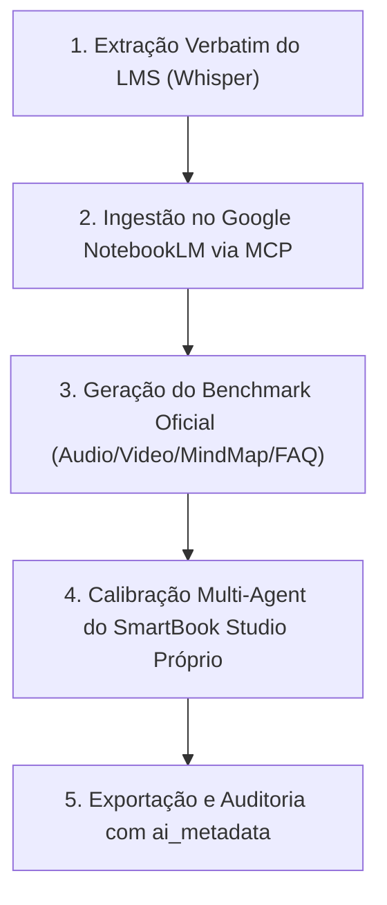

# 🧠 SmartBook Clinical Generator — Arsenal de Cabine & Benchmark MCP

Use esta skill sempre que for criar, calibrar ou enriquecer cadernos do **SmartBook Studio** no ecossistema Body Harmony, garantindo conformidade estrita com a **REGRA 43** (Arsenal Clínico de Cabine) e **REGRA 44** (Benchmark NotebookLM).

---

## 🏛️ Os 4 Pilares da Geração de Elite

1. **Zero Resumos Teóricos Genéricos:** Nenhum material deve se limitar a definições escolares. Cada output deve atuar como uma **ferramenta de trabalho para a Licenciada na cabine** com a paciente deitada na maca.
2. **Setup de Canais e Minutagem Exata:** Toda tabela ou guia clínico deve indicar:
   - Configuração dos Canais 1 a 8 do equipamento (HTM Corrente Russa e Aussie).
   - Frequência (Hz), Largura de Pulso (µs), Rampas (Rise, On, Decay, Off) e ciclo de trabalho.
   - Divisão minuto a minuto das 3 Fases do Protocolo 3S (Sensibilização, Saturação e Sustentação).
3. **Manejo de Intercorrências & Casos de Borda:** Condutas práticas para:
   - Pacientes com prótese de silicone, pós-lipo ou diástase.
   - Queixas de queimação, choque ou dor no nervo ciático por dispersão de corrente.
   - Ajustes imediatos de intensidade e rampa sem interromper a sessão.
4. **Arsenal Comercial de Alto Ticket:** Argumentos de ancoragem para planos de R$ 2.500 a R$ 5.000, roteiros de consulta de avaliação e quebra de objeções baseadas na biofísica da despolarização síncrona.

---

## 🛠️ Workflow de Execução em 4 Passos



### Passo 1: Extração e Preparação da Transcrição
- Obter a transcrição verbatim completa da aula (~15.000 a 30.000 palavras) com marcação temporal em blocos `[MM:SS]`.
- Garantir contagem de palavras e ausência de truncamento.

### Passo 2: Benchmark Oficial via NotebookLM MCP
- Chamar `create_notebook(title)` no MCP `notebooklm`.
- Adicionar as fontes textuais com `add_source_text(notebook_id, title, text)`.
- Gerar o benchmark de referência:
  - `generate_audio_overview(notebook_id)` -> Podcast neural bivocal.
  - `generate_video_overview(notebook_id, language="pt")` -> Resumo em vídeo.
  - `generate_mind_map(notebook_id)` -> Árvore hierárquica de 5 eixos.
  - `chat_with_notebook(notebook_id, message)` -> FAQ clínico com citações `[1]`, `[2]`, `[3]`.

### Passo 3: Geração das 9 Ferramentas do Studio
Ao executar as transformações no SurrealDB/FastAPI, garantir:
- **01. Áudio:** Roteiro dialogado no tom da Dra. Joselene + IA, focado em macetes de cabine e psicologia da paciente.
- **02. Mapa Mental:** Árvore Mermaid de 5 eixos com expansão e drill-down (REGRA 38).
- **03. Flashcards:** 10 cards práticos (parâmetros, casos de cabine, intercorrências e vendas).
- **04. Quiz:** 10 desafios clínicos com casos reais e justificativas profundas.
- **05. Slides:** 10 lâminas executivas com tópicos concisos e notas aprofundadas do orador.
- **06. Relatório:** Dossiê de 8 seções cobrindo biofísica, cronaxia, rampas, mTOR e biossegurança.
- **07. Tabela:** Matriz comparativa de dosimetrias para colagem na cabine (Canais 1 a 8).
- **08. Vídeo:** Roteiro cênico de 5min com minutagem, cenografia e posicionamento de eletrodos.
- **09. Infográfico:** Diagramação visual de recrutamento motor e curvas de cronaxia.

### Passo 4: Auditoria e Rastreabilidade (ai_metadata)
Todo registro deve conter:
- `model`: Identificador real (`qwen-max / Qwen 2.5 72B`).
- `prompt_used`: System prompt da Dra. Harmony + User prompt com o contexto da aula.
- `clinical_rationale`: Justificativa explícita dos parâmetros de dosimetria adotados.
- `generation_metrics`: Latência real e provedor.

## 🛡️ 5. Padrão de Engenharia Fullstack & Blindagem (Nexus V3.2)

### A. Autenticação Híbrida & Painel de Governança
- O backend (`LmsNotebookService.php`) deve suportar:
  1. **Google OAuth 2.0:** Credenciais dinâmicas em `site_config` (`google_oauth_client_id`, `google_oauth_client_secret`).
  2. **Session Token JSON:** Fallback para colagem direta do token JSON gerado pela CLI do NotebookLM.
  3. **Redirect URI Autorizada:** `https://bodyharmony.com.br/api/v1/admin/lms/notebook/auth/google/callback`.

### B. Minutagem Clicável & Player Híbrido (Video Seek)
- Respostas da IA devem conter marcações `[MM:SS]`.
- O backend extrai e calcula `seconds = min * 60 + sec`.
- O frontend (`AiNotebookEmbed.jsx` + `AlunaLessonPlayer.jsx`) formata badges interativos dourados (`#ED7E13`) e executa `handleSeekVideo(seconds)`:
  ```javascript
  const handleSeekVideo = (seconds) => {
    if (videoRef.current) {
      videoRef.current.currentTime = seconds;
      videoRef.current.play();
      window.scrollTo({ top: 0, behavior: 'smooth' });
    }
  };
  ```

### C. Lock Atômico de Cotas Diárias & Bloqueio 429
- Toda dedução de crédito deve ocorrer dentro de transação PDO com `SELECT ... FOR UPDATE`.
- Ao esgotar o limite diário (`today_spent >= daily_limit`), retornar HTTP 429 com link do WhatsApp da coordenação:
  ```json
  {
    "success": false,
    "error": "Limite diário de créditos atingido.",
    "quota_exceeded": true,
    "daily_limit": 5,
    "today_spent": 5,
    "whatsapp_url": "https://wa.me/5511999999999?text=..."
  }
  ```
- O frontend exibe o Card Luxury com botão direto de 1-clique para recarga no WhatsApp.

### D. Suíte de Testes Automatizados In-Memory
- Todos os serviços de IA devem ter suíte de testes em `apps/web-app/src/backend/tests/` rodando via CLI sem dependência de banco de dados externo ou drivers SQLite desativados, usando emulação de Mock PDO/Statement.

---

## 🔒 Checklist de Qualidade Obrigatório
- [ ] O material responde à dúvida de uma profissional com paciente na maca?
- [ ] A tabela inclui Hz, µs, Rise, On, Decay e Off?
- [ ] O simulador contém casos clínicos complexos em vez de perguntas teóricas triviais?
- [ ] As fontes do NotebookLM foram consultadas e respeitadas sem alucinações?
- [ ] O log de mutação foi registrado no Obsidian Vault via `agent_vault_logger.py`?
- [ ] A suíte de testes de segurança executou com 100% PASS?
