# C4 — Diagrama de Componentes (Nível 3)

> Gerado pelo Architect em 2026-06-02

## Backend PHP — Componentes Internos

```mermaid
graph TB
    subgraph "Core System"
        ROUTER[Router.php<br/>~1400 linhas]
        AUTH[AuthMiddleware.php]
        RESP[Response.php]
        CACHE[ResponseCache.php]
        LOGGER[NexusLogger.php]
        ERROR[NexusErrorHandler.php]
        SQLITE[NexusSQLite.php]
    end

    subgraph "Controllers"
        LC[LmsController]
        ALC[AdminLmsController]
        QC[QuizController]
        CC[ContentController]
        CERT[CertificateController]
        AC[AnalyticsController]
        BC[BroadcastController]
        MC[MediaController]
        DHC[DoctorHarmonyController]
        ADHC[AdminDoctorHarmonyController]
        LEAD[LeadController]
        NFC[NexusForensicsController]
    end

    subgraph "Admin Endpoints"
        NEXUS[auth_nexus.php]
        WT[watchtower/core.php]
        WR[war_room/analytics.php]
        ST[signal_tower/]
        VAULT[vault/]
        ENG[engine/]
        IMP[impersonate.php]
    end

    subgraph "Libs"
        GS[GeminiService]
        RS[ResourceService]
        PDF[SimplePDF]
        LS[LoggerService]
        GEO[GeoIPService]
    end

    subgraph "Frontend React"
        API[api.js<br/>Client HTTP]
        DC[DataContext]
        AC_[AuthContext]
        SC[SignalContext]
        AUC[AudioContext]
        RG[ProtectedRoute]
    end

    ROUTER --> AUTH
    ROUTER --> LC & ALC & QC & CC & CERT & AC & BC & MC & DHC & ADHC & LEAD & NFC
    LC & ALC & QC & CC & CERT --> RESP & CACHE
    DHC --> GS
    CERT --> PDF
    LC --> RS
    AC & BC & MC & DHC & ALC --> LS
    AUTH --> SQLITE
    NEXUS --> SQLITE
    WT & WR & ST & VAULT & ENG --> NEXUS

    API --> ROUTER
    API --> DC & AC_ & SC & AUC
    RG --> AC_ & AUC

    style ROUTER fill:#0A3E60,color:#fff
    style AUTH fill:#0A3E60,color:#fff
    style RESP fill:#0A3E60,color:#fff
    style CACHE fill:#0A3E60,color:#fff
    style LOGGER fill:#0A3E60,color:#fff
    style SQLITE fill:#0A3E60,color:#fff
    style LC fill:#ED7E13,color:#fff
    style ALC fill:#ED7E13,color:#fff
    style QC fill:#ED7E13,color:#fff
    style DHC fill:#ED7E13,color:#fff
    style API fill:#0A3E60,color:#fff
    style DC fill:#ED7E13,color:#fff
    style AC_ fill:#ED7E13,color:#fff
```

### Core System
| Componente | Responsabilidade |
|-----------|-----------------|
| **Router (index.php)** | Roteador central: parseia URL, valida auth, instancia controller, chama método |
| **AuthMiddleware** | Valida Bearer/Device/Aluna tokens, Nexus Firewall (IP ban) |
| **Response** | json(), error() — formato padronizado de resposta |
| **ResponseCache** | Cache stale-while-revalidate em disco. Público vs privado |
| **NexusLogger** | Log estruturado com redação de dados sensíveis |
| **NexusErrorHandler** | Tratamento global de exceções |
| **NexusSQLite** | Dual engine SQLite/MySQL para admin |

### Principais Controllers
| Controller | Rotas | Dependências |
|-----------|-------|-------------|
| **LmsController** | LMS licenciada (módulos, aulas, progresso) | Response, ResponseCache, ResourceService |
| **AdminLmsController** | CRUD LMS admin | Response, ResponseCache, LoggerService |
| **QuizController** | Quiz admin + licenciada | Response |
| **DoctorHarmonyController** | Mentoria IA | GeminiService, LoggerService |
| **AnalyticsController** | Watchtower, War Room | LoggerService |
| **BroadcastController** | Comunicados com targeting | — |
| **MediaController** | Gerenciador de mídia | — |
| **NexusForensicsController** | Forense, auditoria | LoggerService |
