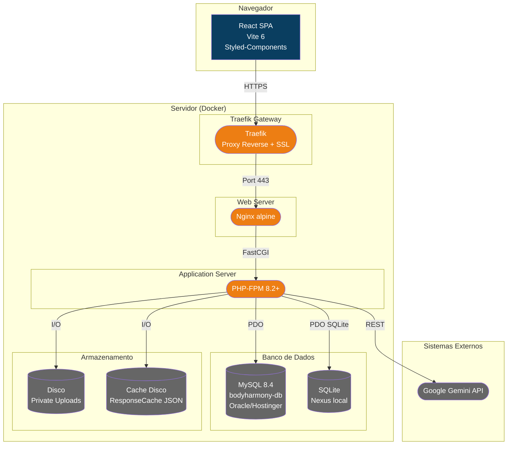

# C4 — Diagrama de Containers (Nível 2)

> Gerado pelo Architect em 2026-06-02

### Containers

| Container | Tecnologia | Função |
|-----------|-----------|--------|
| React SPA | React 18 + Vite 6 | Interface de usuário com lazy loading |
| Traefik | Traefik (Let's Encrypt) | Reverse proxy, SSL termination, routing |
| Nginx | Nginx alpine | Servidor web, static assets, FastCGI |
| PHP-FPM | PHP 8.2+ | API REST, lógica de negócio, cache |
| MySQL | MySQL 8.4 | Banco de dados principal |
| SQLite | SQLite3 (PHP) | Cache admin, firewall rules, audit |
| Private Uploads | Disco (bind mount) | Uploads de mentoria IA, thumbnails, mídia |
| Response Cache | Disco (JSON) | Cache stale-while-revalidate |
