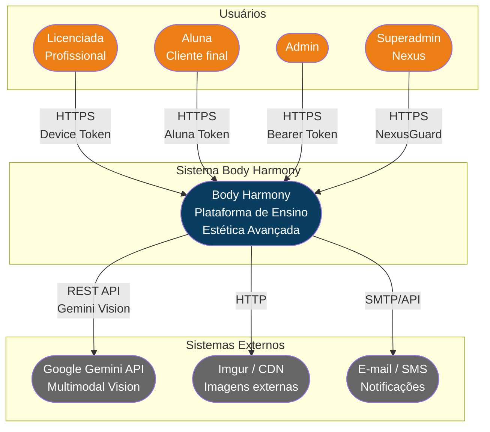

# C4 — Diagrama de Contexto (Nível 1)

> Gerado pelo Architect em 2026-06-02

### Descrição
- **Licenciada**: Profissional que compra o curso. Acessa LMS, mentoria IA, certificados, biblioteca.
- **Aluna**: Cliente final da licenciada. Acesso modular a módulos específicos.
- **Admin**: Gerencia licenciadas, alunas, conteúdo, LMS, mídia, leads.
- **Superadmin (Nexus)**: Acesso irrestrito. Gerencia sistema, segurança, audit, configurações.
- **Google Gemini API**: IA multimodal para análise de casos clínicos (Doctor Harmony).
- **Imgur/CDN**: Imagens de resultados/depoimentos hospedadas externamente.
