# ERD Completo — Body Harmony

> **Gerado pelo Data Master** — 🟢 CONFIRMADO via DDL e migrations

## Diagrama Geral (Mermaid)

```mermaid
erDiagram
    admin_users ||--o{ admin_sessions : "has"
    admin_users ||--o{ admin_nudges : "creates"
    admin_users ||--o{ lms_modules : "modifies"
    admin_users ||--o{ lms_lessons : "modifies"
    admin_users ||--o{ lms_resources : "creates/approves"
    admin_users ||--o{ script_executions : "executes"
    admin_users ||--o{ nexus_security_rules : "updates"
    admin_users ||--o{ ai_clinical_cases : "reviews"

    licenciadas ||--o{ licenciada_devices : "has"
    licenciadas ||--o{ lms_progress : "tracks"
    licenciadas ||--o{ lms_quiz_attempts : "submits"
    licenciadas ||--o{ lms_certificates : "earns"
    licenciadas ||--o{ lms_user_badges : "earns"
    licenciadas ||--o{ lms_points_log : "accumulates"
    licenciadas ||--o{ lms_resource_access : "granted"
    licenciadas ||--o{ admin_nudges : "receives"
    licenciadas ||--o{ ai_clinical_cases : "submits"
    licenciadas ||--o{ ai_mentorship_logs : "uses"
    licenciadas ||--o{ magic_tokens : "generates"
    licenciadas ||--o{ results : "featured_in"

    alunas ||--o{ aluna_devices : "has"
    alunas ||--o{ aluna_course_access : "grants"
    alunas ||--o{ aluna_progress : "tracks"
    alunas ||--o{ aluna_certificates : "earns"

    lms_modules ||--o{ lms_lessons : "contains"
    lms_modules ||--o{ lms_quizzes : "has"
    lms_modules ||--o{ lms_certificates : "certifies"
    lms_modules ||--o{ aluna_course_access : "grants_access"

    lms_lessons ||--o{ lms_attachments : "has"
    lms_lessons ||--o{ lms_progress : "tracked_by"
    lms_lessons ||--o{ aluna_progress : "tracked_by_aluna"

    lms_quizzes ||--o{ lms_questions : "contains"
    lms_quizzes ||--o{ lms_quiz_attempts : "attempted_by"

    lms_questions ||--o{ lms_question_options : "has"

    lms_badges ||--o{ lms_user_badges : "awarded_as"

    lms_resources ||--o{ lms_resource_access : "accessed_via"

    bot_support_tickets ||--o{ support_feedback : "rated_by"
```



## Diagramas por Domínio

### Admin & Auth
```
admin_users 1--N admin_sessions
admin_users 1--N admin_nudges
admin_users 1--N nexus_security_rules
admin_users 1--N script_executions
```

### Licenciadas (LMS)
```
licenciadas 1--N licenciada_devices
licenciadas 1--N lms_progress
licenciadas 1--N lms_quiz_attempts
licenciadas 1--N lms_certificates
licenciadas 1--N lms_user_badges
licenciadas 1--N lms_points_log
licenciadas 1--N lms_resource_access
licenciadas 1--N admin_nudges
licenciadas 1--N ai_clinical_cases
licenciadas 1--N ai_mentorship_logs
licenciadas 1--N magic_tokens
licenciadas 1--N results
```

### Aluna Portal (Cursos Avulsos)
```
alunas 1--N aluna_devices
alunas 1--N aluna_course_access
alunas 1--N aluna_progress
alunas 1--N aluna_certificates
```

### LMS Hierarchy
```
lms_modules 1--N lms_lessons (display_order)
lms_modules 1--N lms_quizzes
lms_modules 1--N lms_certificates
lms_lessons 1--N lms_attachments
lms_lessons 1--N lms_progress
lms_quizzes 1--N lms_questions (order_index)
lms_questions 1--N lms_question_options
lms_badges 1--N lms_user_badges
lms_resources 1--N lms_resource_access
```

### Bot & Support
```
bot_sessions 1--1 chat_id (Telegram state machine)
bot_support_tickets 1--N support_feedback
licenciadas 1--N magic_tokens (auto-login SSO)
```

### Security & Audit
```
auth_logs (independent - login attempts)
audit_logs (independent - system-wide audit)
lms_access_logs (independent - LMS activity)
lgpd_consent_logs 1--N licenciadas
```

## Estatísticas

| Métrica | Valor |
|---|---|
| Total de Tabelas | 42 |
| Foreign Keys | ~35 |
| Unique Constraints | ~20 |
| Índices | ~60 |
| Engine | InnoDB |
| Charset | utf8mb4_unicode_ci |
