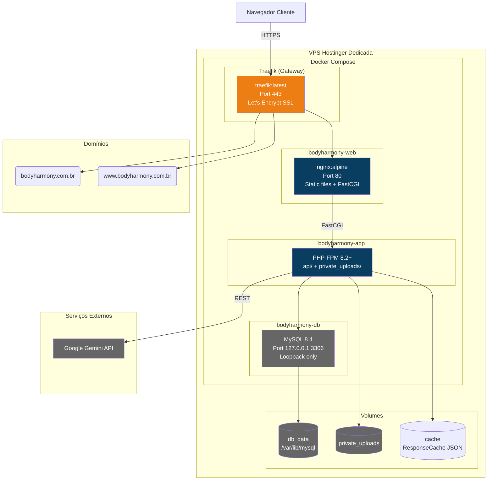

# Deployment — Body Harmony

> Gerado pelo Architect em 2026-06-02
> Confiança: 🟢 CONFIRMADO

## Infraestrutura

## Configuração Docker

### docker-compose.yml
- **3 serviços**: db (MySQL 8.4), app (PHP-FPM), web (Nginx alpine)
- **Traefik labels**: routing por hostname, Let's Encrypt SSL
- **MySQL loopback**: porta 3306 exposta apenas em 127.0.0.1 (Espaço Negativo)
- **Volumes**: db_data (persistente), private_uploads, api code

### Variáveis de Ambiente
| Variável | Valor | Descrição |
|----------|-------|-----------|
| DB_STAGE | PROD | Ambiente de produção |
| DB_HOST | db | Host MySQL (container) |
| DB_NAME | u388974772_bodyharmony_db | Nome do banco |
| SITE_URL | https://bodyharmony.com.br | URL do site |
| APP_SECRET | BodyHarmonySecretKey2026 | HMAC secret para signed URLs |
| NEXUS_ALLOWED_IPS | variável | IPs permitidos no NexusGuard |
| MAINTENANCE_MODE | 0/1 | Feature flag de manutenção |

### Segurança (Regra 2 — Espaço Negativo)
- **MySQL** NÃO exposto para WAN — apenas loopback local (`127.0.0.1:3306`)
- **auth_nexus.php**: IP whitelist via `NEXUS_ALLOWED_IPS`
- **Traefik**: SSL automático via Let's Encrypt
- **Response Cache**: arquivos JSON em disco (sem exposição pública)

## CI/CD
- **GitHub**: repositório de código
- **Deploy manual**: via SSH + Docker Compose na VPS Hostinger (IP: 2.25.156.25)
