# ERD Completo — Body Harmony

> Gerado pelo Architect em 2026-06-02
> Confiança: 🟢 CONFIRMADO

```mermaid
erDiagram
    %% ─── AUTH ───
    admin_users {
        int id PK
        varchar username
        varchar password_hash
        varchar role "admin|superadmin"
    }
    admin_sessions {
        int id PK
        int user_id FK
        varchar token
        datetime expires_at
        tinyint is_active
    }
    licenciadas {
        int id PK
        varchar name
        varchar cpf
        varchar email
        varchar username
        varchar password_hash
        tinyint is_active
        tinyint force_password_change
        int max_devices "default 2"
        int failed_login_attempts
        datetime locked_until
        datetime last_login_at
        varchar photo_url
        varchar whatsapp
        varchar instagram
        varchar state
        varchar location
        tinyint pinned
        tinyint is_tester
        bigint telegram_user_id
        text admin_notes
        decimal progress_percent
        json lgpd_status
        int last_active_lesson_id FK
        datetime created_at
    }
    licenciada_devices {
        int id PK
        int licenciada_id FK
        varchar device_token
        varchar user_agent
        varchar ip_address
        varchar fingerprint_hash
        tinyint is_active
        datetime last_used_at
        datetime created_at
    }
    alunas {
        int id PK
        varchar name
        varchar cpf
        varchar email
        varchar password_hash
        tinyint is_active
        tinyint force_password_change
        int max_devices "default 1"
        int failed_login_attempts
        datetime locked_until
        datetime last_login_at
    }
    aluna_devices {
        int id PK
        int aluna_id FK
        varchar device_token
        varchar user_agent
        varchar ip_address
        tinyint is_active
        datetime last_used_at
        datetime created_at
    }
    auth_logs {
        int id PK
        int user_id
        varchar email
        varchar ip_address
        text user_agent
        varchar status "success|failure_credentials"
        int risk_score
        json risk_details
        datetime created_at
    }

    %% ─── LMS ───
    lms_modules {
        int id PK
        varchar title
        text description
        varchar cover_image
        int display_order
        tinyint is_active
        int last_modified_by FK
        datetime last_modified_at
        datetime created_at
    }
    lms_lessons {
        int id PK
        int module_id FK
        varchar title
        text description
        varchar video_type
        varchar video_ref
        varchar hls_path
        varchar file_path
        int duration_seconds
        varchar thumbnail_ref
        int attachment_count
        int display_order
        tinyint is_active
        int last_modified_by FK
        datetime last_modified_at
        datetime created_at
    }
    lms_progress {
        int id PK
        int licenciada_id FK
        int lesson_id FK
        tinyint is_completed
        decimal progress_percent
        datetime last_watched_at
    }
    lms_attachments {
        int id PK
        int lesson_id FK
        varchar title
        varchar file_type
        varchar file_path
        tinyint is_downloadable
        datetime created_at
    }
    lms_quizzes {
        int id PK
        int module_id FK
        varchar title
        int min_score "default 70"
        datetime created_at
    }
    lms_questions {
        int id PK
        int quiz_id FK
        text question_text
        varchar question_type
        int order_index
        datetime created_at
    }
    lms_question_options {
        int id PK
        int question_id FK
        text option_text
        tinyint is_correct
        int order_index
    }
    lms_quiz_attempts {
        int id PK
        int quiz_id FK
        int licenciada_id FK
        decimal score
        tinyint passed
        json answers
        datetime attempted_at
    }
    lms_certificates {
        int id PK
        int licenciada_id FK
        int module_id FK
        varchar hash_code
        datetime created_at
    }
    lms_resources {
        int id PK
        varchar title
        text description
        varchar file_type
        varchar file_path
        varchar status "pending|approved|rejected"
        tinyint is_active
        datetime created_at
    }
    lms_resource_access {
        int id PK
        int resource_id FK
        int licenciada_id FK
        datetime granted_at
    }

    %% ─── ALUNA SPECIFIC ───
    aluna_course_access {
        int id PK
        int aluna_id FK
        int module_id FK
        datetime granted_at
        datetime expires_at
        int granted_by FK
    }
    aluna_progress {
        int id PK
        int aluna_id FK
        int lesson_id FK
        decimal progress_percent
        tinyint is_completed
        datetime last_watched_at
        datetime completion_date
    }
    aluna_certificates {
        int id PK
        int aluna_id FK
        int module_id FK
        varchar hash_code
        datetime created_at
    }

    %% ─── DOCTOR HARMONY ───
    lms_licenses {
        int id PK
        varchar license_key
        varchar ai_plan_type
        int ai_credits_total
        int ai_credits_used
        varchar status "active"
    }
    lms_licenciada_licenses {
        int id PK
        int license_id FK
        int licenciada_id FK
    }
    ai_clinical_cases {
        int id PK
        int license_id FK
        int licenciada_id FK
        varchar case_title
        text case_description
        varchar photo_path
        text doctor_harmony_response
        decimal confidence_score
        tinyint needs_review
        text mentor_feedback
        int mentor_id FK
        varchar status "ANALYZED|PENDING|REVIEWED"
        tinyint is_admin_test
        datetime created_at
    }
    ai_mentorship_logs {
        int id PK
        int license_id FK
        varchar interaction_type "VISION|TEXT|WIDGET_EVENT"
        varchar image_path
        datetime created_at
    }
    ai_mentorship_sessions {
        int id PK
        int licenciada_id FK
        json session_data
        datetime last_interaction
    }
    ai_config {
        int id PK
        varchar config_key "UNIQUE"
        text config_value
        datetime updated_at
    }
    prompts {
        varchar path
        text content
    }

    %% ─── ADMIN / NEXUS ───
    audit_logs {
        int id PK
        int user_id
        varchar action
        varchar severity
        text description
        json details
        varchar user_type
        varchar ip_address
        datetime created_at
    }
    nexus_security_rules {
        int id PK
        varchar rule_key
        text rule_value
        tinyint is_active
    }
    security_ip_rules {
        int id PK
        varchar ip_address
        varchar rule_type "BAN"
        datetime expires_at
        datetime created_at
    }
    site_config {
        int id PK
        varchar config_key
        text config_value
        datetime created_at
    }
    site_content {
        int id PK
        varchar section
        varchar key
        text value
    }
    storage_files {
        int id PK
        varchar file_name
        varchar file_type
        bigint file_size
        varchar media_category
        int width
        int height
        varchar hash
        int access_count
        datetime created_at
    }
    feature_flags {
        int id PK
        varchar flag_key
        varchar flag_value
        tinyint is_active
    }

    %% ─── SITE ───
    leads {
        int id PK
        varchar name
        varchar whatsapp
        varchar email
        varchar source
        varchar status "new|contacted|qualified"
        datetime created_at
    }
    mentors {
        int id PK
        varchar name
        varchar nickname
        varchar role
        text bio
        varchar photo_url
        varchar instagram
        datetime created_at
    }
    faq {
        int id PK
        text question
        text answer
        varchar category
        int display_order
        tinyint active
    }
    system_broadcasts {
        int id PK
        varchar title
        text message
        varchar type
        json target_roles
        json target_levels
        tinyint is_blocking
        tinyint is_active
        datetime created_at
    }
    system_broadcast_logs {
        int id PK
        int broadcast_id FK
        int user_id
        varchar user_type
        datetime read_at
        datetime created_at
    }
    testimonials {
        int id PK
        varchar name
        text text
        varchar photo
        tinyint active
    }

    %% ─── RELACIONAMENTOS ───
    admin_users ||--o{ admin_sessions : "cria"
    licenciadas ||--o{ licenciada_devices : "possui"
    alunas ||--o{ aluna_devices : "possui"

    lms_modules ||--o{ lms_lessons : "contém"
    lms_modules ||--o{ lms_quizzes : "tem"
    lms_quizzes ||--o{ lms_questions : "agrupa"
    lms_questions ||--o{ lms_question_options : "tem"
    lms_quizzes ||--o{ lms_quiz_attempts : "registra"
    lms_lessons ||--o{ lms_progress : "monitora"
    lms_lessons ||--o{ lms_attachments : "anexa"
    lms_modules ||--o{ lms_certificates : "certifica"
    licenciadas ||--o{ lms_certificates : "recebe"
    licenciadas ||--o{ lms_progress : "faz"

    lms_licenses ||--o{ lms_licenciada_licenses : "vincula"
    lms_licenciada_licenses }o--|| licenciadas : "licencia"
    lms_licenses ||--o{ ai_clinical_cases : "gera"
    licenciadas ||--o{ ai_clinical_cases : "submete"
    lms_licenses ||--o{ ai_mentorship_logs : "loga"
    licenciadas ||--o{ ai_mentorship_sessions : "sessão"

    system_broadcasts ||--o{ system_broadcast_logs : "lido por"
    lms_resources ||--o{ lms_resource_access : "acesso"
    licenciadas ||--o{ lms_resource_access : "acessa"

    alunas ||--o{ aluna_course_access : "acesso modular"
    alunas ||--o{ aluna_progress : "progresso"
    alunas ||--o{ aluna_certificates : "certificados"
    lms_modules ||--o{ aluna_course_access : "concede"
    lms_modules ||--o{ aluna_certificates : "certifica"
```

## Notas sobre o Modelo
- **Dual-user system**: licenciadas (profissionais) e alunas (clientes finais) coexistem com estruturas paralelas
- **License-bound credits**: créditos de IA são vinculados à licença, não diretamente à licenciada
- **Broadcast tracking**: lido/não-lido via LEFT JOIN com NULL check em system_broadcast_logs
- **Cache separado**: feature_flags e nexus_security_rules podem estar em SQLite ou MySQL
