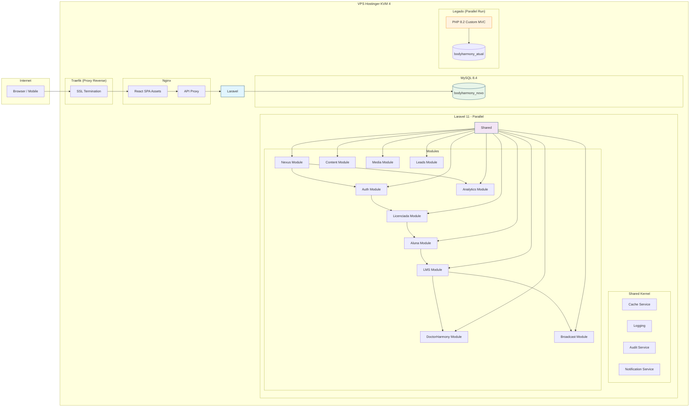

# Target Architecture

> Arquitetura alvo do sistema novo, respeitando o paradigma escolhido em `paradigm_decision.md` e a estratégia confirmada em `migration_strategy.md`.

## Visão geral

Sistema Laravel 11 modular (DDD Modular Monolith) com API REST consumida por frontend React SPA. Cada bounded context é um módulo Laravel independente com seu próprio Service Provider, Models, Repositories, Services e Actions. Shared Kernel contém cross-cutting (cache, logging, notificações, audit). Ambos os sistemas (legado PHP + novo Laravel) rodam em paralelo na mesma VPS durante validação. MySQL 8.4 como banco único.

## Diagrama (Mermaid)

## Componentes

| Componente | Tipo | Responsabilidade | Origem |
|---|---|---|---|
| Auth Module | API | Login admin/licenciada/aluna, tokens, middlewares, impersonation, throttling, firewall | fundido de Controllers/Auth*, AuthMiddleware, NexusGuard |
| Licenciada Module | API | CRUD licenciadas, dashboard, dispositivos, gestão de sessão | fundido de Controllers/LicenciadasController, licenciada/ |
| Aluna Module | API | Portal aluna, progresso, certificados, signed URLs | fundido de Controllers/Aluna* |
| LMS Module | API | Módulos, aulas, quizzes, progression lock, biblioteca | fundido de LmsController, QuizController, AdminLmsController |
| DoctorHarmony Module | API | Análise Gemini, créditos, revisão híbrida, crise, sessões | fundido de DoctorHarmonyController, GeminiService |
| Broadcast Module | API | Comunicados, acknowledge, targeting por role, blocking | fundido de BroadcastController, signal_tower/ |
| Content Module | API | Mentores, FAQ, resultados (CRUDs relacionados) | fundido de ContentController, FaqController, ResultController |
| Media Module | API | Upload, listagem, cleanup, hash dedup | Controllers/MediaController |
| Nexus Module | API | Firewall IP, auditoria, forense, manutenção, watchtower | fundido de Nexus*, admin/watchtower, admin/war_room |
| Leads Module | API | Captura, funil, notificação | Controllers/LeadController |
| Analytics Module | API | Watchtower dashboard, war room, churn, bot stats | Controllers/AnalyticsController |
| Frontend SPA | UI | React com lazy loading, Context API, services | Preservado de frontend/src/ |
| Shared Kernel | Service | Cache, logging, audit, notificações, helpers | Novo |

## Bounded contexts

### BC-Auth: Autenticação e Autorização
- **Responsabilidade**: Login admin/licenciada/aluna, middlewares, impersonation, throttling, firewall IP, superadmin guard
- **Justificativa do agrupamento / separação**: Autenticação é pré-requisito para todos os outros contexts. Separar firewall IP (Nexus) para este context por coesão de segurança.
- **Componentes internos**: AuthController, AuthMiddleware, Guard, ThrottleService, IPFirewallService
- **Aggregates**: AdminSession, LicenciadaDevice, AlunaDevice, SecurityRule

### BC-Licenciada: Gestão de Licenciadas
- **Responsabilidade**: CRUD, dashboard, dispositivos, progresso global
- **Justificativa do agrupamento / separação**: Licenciada é o perfil central. Dashboard e dispositivos são coesos com o aggregate Licenciada.

### BC-Aluna: Portal da Aluna
- **Responsabilidade**: Autenticação aluna, progresso, certificados, signed URLs
- **Justificativa do agrupamento / separação**: Aluna é perfil secundário com escopo limitado. Separado de Licenciada por regras de negócio diferentes (max_devices=1, token prefixado al_).

### BC-LMS: Learning Management System
- **Responsabilidade**: Módulos, aulas, quizzes, progression lock, biblioteca, certificados
- **Justificativa do agrupamento / separação**: Núcleo educacional. Strict Progression Lock une módulos, quizzes e certificados em um contexto transacional.

### BC-DoctorHarmony: Mentoria IA
- **Responsabilidade**: Análise clínica via Gemini, créditos, revisão híbrida, detecção de crise, sessões
- **Justificativa do agrupamento / separação**: Domínio especializado com integração externa (Gemini API) e regras próprias de crédito e LGPD.

### BC-Broadcast: Comunicados
- **Responsabilidade**: Comunicados, acknowledge, targeting, blocking
- **Justificativa do agrupamento / separação**: Domínio independente com fluxo próprio (criação → targeting → acknowledge → expiração).

### BC-Content: Conteúdo Público
- **Responsabilidade**: Mentores, FAQ, resultados (CRUDs públicos)
- **Justificativa do agrupamento / separação**: CRUDs com comportamento similar (público GET, admin CRUD). Fundidos para reduzir boilerplate.

### BC-Media: Gerenciamento de Mídia
- **Responsabilidade**: Upload, validação MIME, hash, cleanup
- **Justificativa do agrupamento / separação**: Serviço de infraestrutura compartilhado entre conteúdos e uploads.

### BC-Nexus: Administração e Segurança
- **Responsabilidade**: Firewall IP, auditoria, forense, manutenção, watchtower, war room
- **Justificativa do agrupamento / separação**: Domínio de administração avançada e segurança, separado do Shared Kernel por ser específico do body-harmony.

### BC-Leads: Captura de Leads
- **Responsabilidade**: Formulário público, funil, notificação email
- **Justificativa do agrupamento / separação**: Domínio de marketing/comercial, ciclo de vida independente.

### BC-Analytics: Monitoramento
- **Responsabilidade**: Watchtower, war room, churn, bot stats
- **Justificativa do agrupamento / separação**: Domínio de leitura intensiva, pode usar queries específicas sem afetar contexts transacionais.

## Decisões arquiteturais (ADR-style resumido)

### AD-01: Modular Monolith vs Microsserviços
- **Decisão**: Modular Monolith (Laravel modules) para o prazo de 24h
- **Alternativas descartadas**: Microsserviços (overhead de comunicação, deploy, monitoramento), Monolito puro (não captura fronteiras de domínio)
- **Justificativa**: Prazo de 24h — modular monolith oferece isolamento de domínio sem custo de deploy independente. Futura extração para microsserviços é possível pois cada module tem boundaries claras.

### AD-02: MySQL Único vs Bancos por Context
- **Decisão**: Banco MySQL único (bodyharmony_novo) com prefixo ou schema por context
- **Alternativas descartadas**: Um banco por context (overhead de conexões na KVM 4), bancos diferentes (complexidade desnecessária)
- **Justificativa**: MySQL 8.4 já existente na VPS; recurso limitado da KVM 4 (4 vCPUs, 8GB RAM) não comporta múltiplos bancos com performance aceitável.

### AD-03: API REST vs GraphQL vs RPC
- **Decisão**: REST + JSON (mesmo padrão do legado)
- **Alternativas descartadas**: GraphQL (curva de aprendizado), RPC (menos padronizado)
- **Justificativa**: O frontend React já consome REST; migrar padrão de API aumentaria risco no prazo de 24h.

### AD-04: Styled-Components vs Tailwind
- **Decisão**: Preservar Styled-Components (como no legado)
- **Alternativas descartadas**: Tailwind (reescrita total do frontend)
- **Justificativa**: O frontend React legado já está integralmente em Styled-Components. Reescrever para Tailwind em 24h é inviável.

### AD-05: Autenticação JWT vs Sanctum vs Passport
- **Decisão**: Laravel Sanctum (token-based simples, suporta SPA + mobile)
- **Alternativas descartadas**: JWT manual (overhead), Passport (OAuth2 pesado para o escopo)
- **Justificativa**: Sanctum oferece token-based simples (similar ao device token legado) com suporte a múltiplos guards (admin, licenciada, aluna).

## Honra ao paradigma escolhido

- **Paradigma alvo**: OO com DI (Laravel 11)
- **Como a arquitetura honra esse paradigma**:
  - **DI via Service Container**: cada módulo registra seus serviços no Service Provider; controllers recebem dependências por injeção no construtor
  - **Interfaces (Contracts)**: cada serviço de domínio tem uma interface (ex: `LicenciadaRepositoryInterface`) no namespace `Contracts`; binding no Service Provider
  - **Repositories**: toda persistência é encapsulada em Repository classes injetadas nos Services/Actions, nunca nos controllers
  - **Services/Actions**: lógica de negócio em Service classes ou Action classes com responsabilidade única, não em controllers
  - **Separation of Concerns**: Controllers → apenas HTTP handling; Services → regras de negócio; Repositories → persistência; FormRequests → validação

## Bordas com o legado durante a migração

Durante o parallel run, ambos os sistemas (legado PHP + Laravel novo) rodam na mesma VPS com portas diferentes. O Traefik pode rotear tráfego seletivamente para testes. Não há dependência de dados entre eles — cada um usa seu próprio banco MySQL. O legado permanece como fonte da verdade até o cutover.
