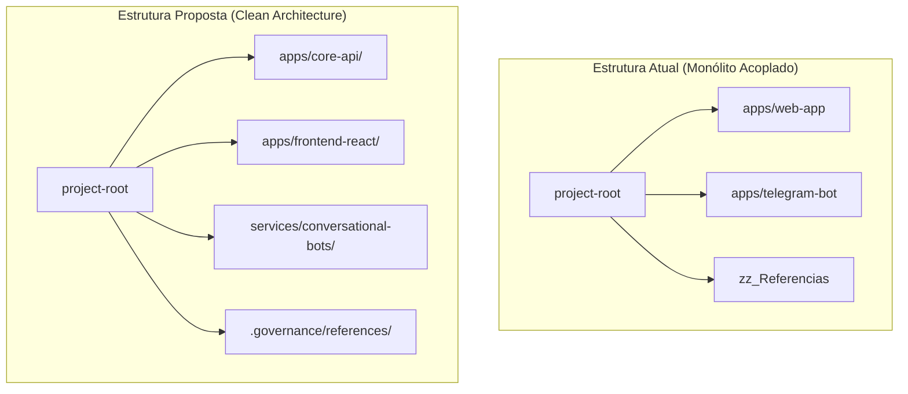

# 🗺️ Mapa de Estrutura de Diretórios (OpenSpec V3.1)

**Status:** ✅ ATIVO  
**Data:** 2026-05-29  
**Versão:** V124 (Nexus Era)  
**Autor:** Principal Full-Stack Engineer (Antigravity Agent)  

---

## 📊 1. Árvore de Diretórios (Visão Geral)

```
project-root/
│
├── .agent/                  # Regras e Workflows de IA (Nexus Guard)
├── apps/                    # Core de Aplicações e Serviços Produtivos
│   ├── telegram-bot/        # Bot conversacional em Python (aiogram)
│   ├── web-app/             # Monólito Híbrido (React + PHP 8.4 Vanilla)
│   └── whatsapp-bot/        # Automação conversacional complementar (Node.js)
│
├── infrastructure/          # Persistência de Dados e Recursos de Infra
│   └── database/            # SQL Schema Consolidado e 64+ Migrations
│
├── Landing_Pages/           # Ecossistema de Vendas e Páginas Promocionais
├── Operations/              # Scripts e utilitários Powershell de Deploy/OPS
├── openspec/                # Sistema de Governança e Fonte da Verdade
│   ├── archive/             # Arquivo histórico de deltas e planos estabilizados
│   ├── deltas/              # Planos de implementação ativos (PLAN-*.md)
│   ├── master/              # Especificações canônicas ativas (Master Specs)
│   └── tracker/             # Auditoria viva, changelogs e mapas operacionais
│
├── logs/                    # Logs consolidados de DevOps, deploy e Nexus
├── private_uploads/         # Uploads confidenciais isolados (Segurança)
├── scripts/                 # Automações de banco e empacotamento local
├── tests/                   # Suítes de testes de carga, stress e e2e
├── tmp_mpdf/                # Diretório temporário gravável para mPDF (Local)
├── zz_Referencias/          # Biblioteca estática offline de apoio do cliente
│
└── build/                   # Artefato de compilação legado (DEPRECATED)
```

---

## 🗂️ 2. Mapeamento e Criticidade Técnica

### 1. `.agent/`
*   **Conteúdo:** Diretrizes de persona (`bodyharmony.md`) e 17 workflows `/slash-commands` em formato markdown.
*   **Importância:** Single Source of Truth para o comportamento, restrições e stack de desenvolvimento do agente de IA (React Styled-Components + PHP 8.4 Vanilla).
*   **Impacto de Mudanças:** Riscos severos de regressão em comandos de DevOps se os workflows perderem correspondência física com scripts vigentes.
*   **Status / Organização:** 🟢 Estável. Manter isolado e versionado.

### 2. `apps/`
*   **Conteúdo:** 
    *   `web-app/`: O portal principal. Frontend React compilado com Vite e Backend em PHP 8.4 Vanilla com roteador centralizado.
    *   `telegram-bot/`: Bot em Python/aiogram.
    *   `whatsapp-bot/`: Bot em TypeScript.
*   **Importância:** O núcleo produtivo que serve as licenciadas, alunas e superadministradores (Nexus).
*   **Impacto de Mudanças:** Mover pastas internas quebra os caminhos do script `build-release.js` e do pipeline de deploy.
*   **Status / Organização:** 🟡 Complexo. *Sugestão de Reorganização Futura:* Separar os Bots em repositórios isolados se o time crescer, deixando o portal principal focado estritamente na interface web.

### 3. `infrastructure/`
*   **Conteúdo:** Diretório do banco de dados (`database/`), migrations versionadas, snapshots de homologação e chaves SSH.
*   **Importância:** Fonte da verdade da persistência de dados. Mantém o `DATABASE_MASTER_V36_1.sql` (Master Schema).
*   **Impacto de Mudanças:** Alterar migrations já comitadas corrompe a integridade local vs produção, impedindo a consistência na tabela `licenciadas` e travando a entrega.
*   **Status / Organização:** 🟢 Estável. *Sugestão:* Mover chaves SSH do Staging Ubuntu (`oracle/`) para uma subpasta específica de homologação.

### 4. `logs/`
*   **Conteúdo:** Logs de build local, deploys (`deploy.log` com ~60MB) e logs do Nexus (`Nexus.log`).
*   **Importância:** Observabilidade e depuração do sistema em tempo de execução.
*   **Impacto de Mudanças:** Excluir a pasta pode travar a escrita do mPDF ou PHP se as permissões de gravação de scripts falharem.
*   **Status / Organização:** 🟡 Crítico (Tamanho). *Sugestão:* Executar limpeza urgente no `deploy.log` para liberar armazenamento de desenvolvimento e criar script automático de rotação de logs.

### 5. `private_uploads/`
*   **Conteúdo:** Certificados e mídias confidenciais de alunas.
*   **Importância:** Protegido rigidamente fora do escopo acessível do `public_html` via regra `.htaccess` (`Deny from all`).
*   **Impacto de Mudanças:** Mover para pasta pública viola a conformidade com a LGPD e regras estritas de proteção de ativos.
*   **Status / Organização:** 🟢 Seguro.

### 6. `Operations/`
*   **Conteúdo:** Scripts PS1 de deploy (`deploy-pro.ps1`, `deploy-hostinger.ps1`, `force-deploy.ps1`).
*   **Importância:** A espinha dorsal do pipeline de entrega contínua do monólito para a Hostinger.
*   **Impacto de Mudanças:** Qualquer quebra nestes scripts impede de imediato novas releases estruturais do portal.
*   **Status / Organização:** 🟡 Estável mas fragmentado. *Sugestão:* Fundir `deploy-pro.ps1` e `deploy-hostinger.ps1` em um único empacotador tático.

### 7. `zz_Referencias/`
*   **Conteúdo:** Materiais estáticos de apoio, estratégias comerciais, manuais e prompts.
*   **Importância:** Consulta histórica sobre regras de negócio originais.
*   **Impacto de Mudanças:** Nenhum impacto técnico.
*   **Status / Organização:** 🟢 Estável. Rigorosamente gitignorado no empacotador de produção.

### 8. `build/` (Raiz)
*   **Conteúdo:** Assets de compilação antigos da Hostinger.
*   **Importância:** Totalmente obsoleto e redundante. O build canônico moderno é gerado sob `apps/web-app/build/public_html`.
*   **Impacto de Mudanças:** Nenhum.
*   **Status / Organização:** 🗑️ DEPRECATED. *Sugestão:* Excluir integralmente no próximo ciclo de limpeza.

---

## 🛡️ 3. Matriz de Impacto e Proteção de Ativos

| Diretório | Regra de Proteção (Nexuspath) | Consequência da Violação |
| :--- | :--- | :--- |
| `private_uploads/` | Deve residir obrigatoriamente fora do escopo `public_html`. | Vazamento direto de certidões e mídias clínicas confidenciais. |
| `infrastructure/database/` | Proibido commits com dados reais criptografados ou hashes administrativos expostos. | Risco de engenharia reversa de credenciais de licenciadas em produção. |
| `apps/web-app/` | `node_modules` e arquivos `.env` locais devem constar estritamente no `.gitignore`. | Vazamento de chaves de API do Gemini e credenciais da Hostinger. |

---

## 🚀 4. Proposta de Reorganização Futura

Para elevar a arquitetura do ecossistema ao nível de excelência corporativa, recomenda-se a seguinte transição estrutural em médio prazo:



### Ações de Reorganização Sugeridas:
1.  **Segregação Estrita**: Mover `zz_Referencias` para uma pasta de documentação oculta `.governance/references/`, despoluindo a raiz.
2.  **Exclusão Definitiva de Resíduos**: Purgar a pasta redundante `build/` da raiz do repositório para evitar que subagentes usem arquivos compilados obsoletos.
3.  **Higiene de Logs**: Implementar rotinas automáticas de compactação dos arquivos sob `logs/` via cronjob recorrente de DevOps.
