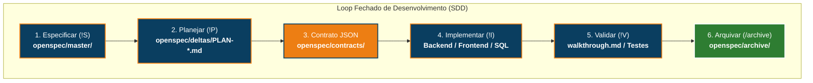
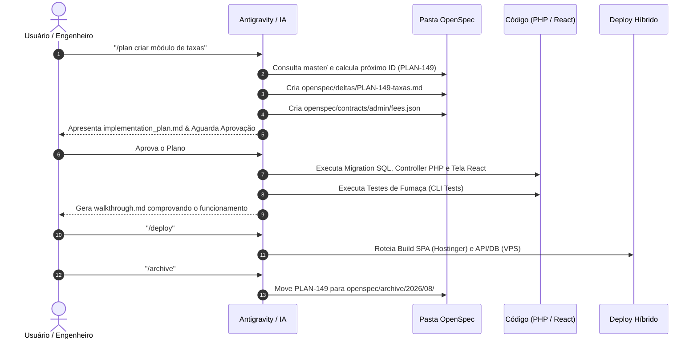
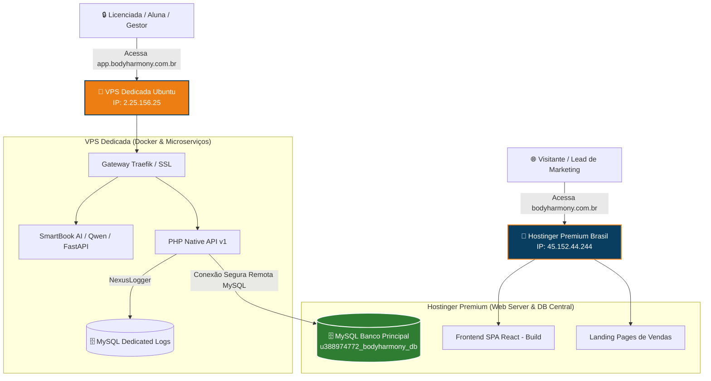
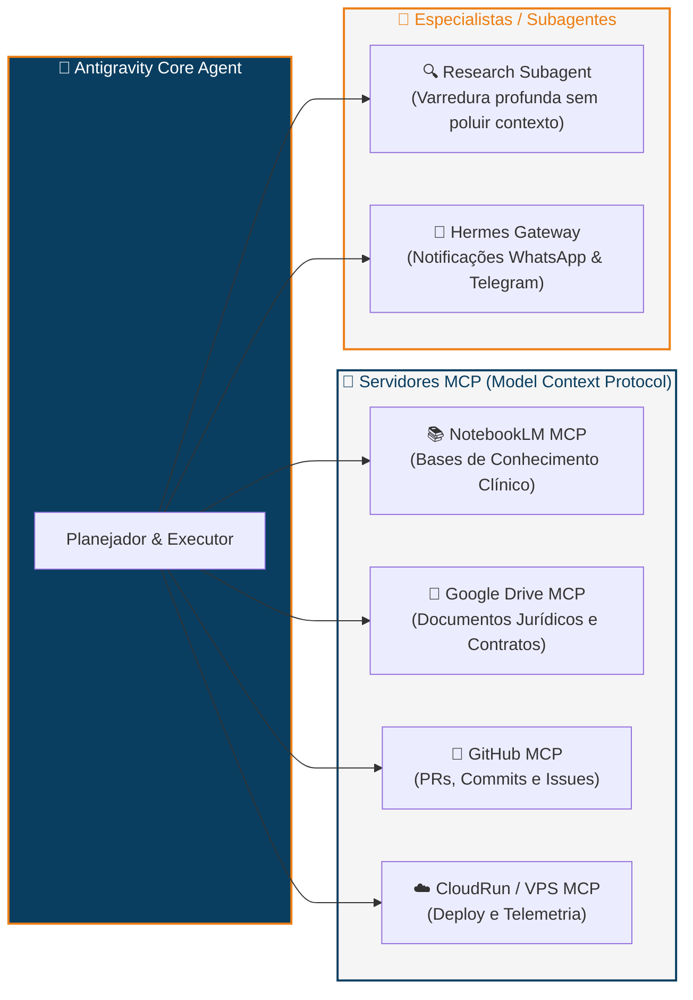

# 📘 Manual Mestre de Workflows & Spec-Driven Development (SDD)
## Guia Definitivo de Operação, Governança e Automação — Ecossistema Body Harmony (Nexus V3.1)

> **Público-alvo:** Desenvolvedores, Engenheiros de Prompt, Agentes de IA, Gerentes de Produto e Stakeholders.  
> **Objetivo:** Explicar de forma cristalina, intuitiva e didática como funciona o desenvolvimento orientado por especificações (SDD), a governança de código, os comandos de automação do Antigravity e a esteira de deploy híbrido.

---

## 🧭 Sumário Executivo
1. [Por Que Não Fazemos "Vibe Coding"? (A Filosofia SDD)](#1-por-que-não-fazemos-vibe-coding-a-filosofia-sdd)
2. [A Estrutura do OpenSpec (A Fonte da Verdade)](#2-a-estrutura-do-openspec-a-fonte-da-verdade)
3. [Ciclo de Vida de uma Tarefa (Do Problema ao Arquivamento)](#3-ciclo-de-vida-de-uma-tarefa-do-problema-ao-arquivamento)
4. [Dicionário de Comandos & Workflows Agênticos](#4-dicionário-de-comandos--workflows-agênticos)
5. [Arquitetura de Deploy Híbrido (Hostinger Premium vs VPS)](#5-arquitetura-de-deploy-híbrido-hostinger-premium-vs-vps)
6. [O Ecossistema de IA: Agentes, Subagentes & MCPs](#6-o-ecossistema-de-ia-agentes-subagentes--mcps)
7. [Pilares Constitucionais & Conceitos-Chave (Invariantes)](#7-pilares-constitucionais--conceitos-chave-invariantes)
8. [Exemplo Prático Passo a Passo (End-to-End Walkthrough)](#8-exemplo-prático-passo-a-passo-end-to-end-walkthrough)
9. [Anti-Patterns: O Que NUNCA Fazer](#9-anti-patterns-o-que-nunca-fazer)

---

## 1. Por Que Não Fazemos "Vibe Coding"? (A Filosofia SDD)

Em projetos tradicionais ou amadores com inteligência artificial, é comum o desenvolvedor solicitar: *"Adicione um botão de download de contrato"* e a IA sair alterando 10 arquivos sem planejamento prévio. Isso é chamado de **"Vibe Coding"** e inevitavelmente resulta em:
- Quebra de contratos de API.
- Apagamento acidental de regras de segurança (ex: bypass de autenticação).
- Desperdício de tokens de contexto da IA.
- Impossibilidade de rastrear o que foi feito ou reverter erros com segurança.

### 🛡️ O Paradigma do Spec-Driven Development (SDD)
No ecossistema **Body Harmony**, **NENHUMA LINHA DE CÓDIGO PRODUTIVO É ESCRITA ANTES DA ESPECIFICAÇÃO**.

A inteligência artificial opera sob um regime matemático de 4 etapas:



1. **Especificar:** Entendemos as regras gerais e limites do sistema (`master/`).
2. **Planejar:** Criamos um plano atômico com checklist e escopo delimitado (`deltas/PLAN-*.md`).
3. **Contratar:** Definimos o formato exato dos dados que trafegam entre Frontend e Backend (`contracts/`).
4. **Implementar:** Executamos o código respeitando 100% o contrato.
5. **Validar:** Testamos, documentamos o resultado e verificamos ausência de regressões.
6. **Arquivar:** O plano concluído é arquivado no histórico, mantendo a área de trabalho limpa.

---

## 2. A Estrutura do OpenSpec (A Fonte da Verdade)

Todo o cérebro do projeto reside no diretório `/openspec`. Essa estrutura garante que qualquer novo agente ou engenheiro saiba exatamente onde procurar as regras do negócio:

```
openspec/
├── master/          # 🏛️ A CONSTITUIÇÃO: Especificações perenes do sistema
│   ├── 00-spec-driven-development-guide.md  <- Você está aqui!
│   ├── 01-architecture-v6.md                <- Arquitetura e infraestrutura
│   ├── 12-database-schema.md                <- Dicionário completo do MySQL
│   ├── 30-nexus-architecture.md             <- Regras de segurança e governança
│   └── navigation-sitemap.md                <- Mapa de rotas e telas
│
├── deltas/          # 🚧 O CANTEIRO DE OBRAS: Planos ativos em andamento
│   ├── PLAN-148-arquitetura-unificada.md    <- Exemplo de plano em execução
│   └── DIAGNOSTIC-20260829-financeiro.md    <- Diagnósticos forenses
│
├── contracts/       # 📜 OS CONTRATOS: Schemas JSON de APIs
│   ├── admin/contracts/get-contracts.json   <- Payload de entrada e saída
│   └── shop/checkout/process-payment.json   <- Estrutura de dados de checkout
│
├── tracker/         # 📊 O PAINEL DE CONTROLE: Monitoramento e auditoria viva
│   ├── regression-watch.md                  <- Checklist de rotas críticas
│   └── V124_Directory_Structure_Map.md      <- Mapa de arquivos do repositório
│
└── archive/         # 📦 O MUSEU HISTÓRICO: Planos e deltas já concluídos
    ├── 2026/08/                             <- Planos arquivados organizados por data
    └── legacy-plans/                        <- Histórico de sprints anteriores
```

---

## 3. Ciclo de Vida de uma Tarefa (Do Problema ao Arquivamento)

Quando surge uma nova demanda (ex: *"Permitir que o Gestor cadastre uma nova taxa para Licenciadas"*), este é o fluxo obrigatório:



---

## 4. Dicionário de Comandos & Workflows Agênticos

No Antigravity e no Nexus Protocol, usamos comandos especiais chamados **Slash Commands** e **Workflows**. Veja para que serve cada um:

| Comando | Nome | Quando Usar | O Que Ele Faz por Baixo dos Panos |
| :--- | :--- | :--- | :--- |
| `/grill-me` | **Alinhamento Socrático** | Quando a tarefa tem dúvidas ou opções de design | A IA entrevista você pergunta a pergunta até fechar 100% dos requisitos. |
| `/plan` | **Planejamento Atômico** | Início de qualquer nova feature ou refatoração | Cria o arquivo `openspec/deltas/PLAN-*.md` e o contrato JSON obrigatório. |
| `/forward` | **Diretriz de Ciclo** | Após a aprovação de um plano | Orienta a IA a ler o plano aprovado e seguir para a codificação sem desvios. |
| `/implement`| **Execução Segura** | Durante a codificação | Modifica arquivos, cria migrations e atualiza o frontend respeitando o contrato. |
| `/deploy` | **Esteira de Publicação** | Quando a tarefa está pronta para produção | Roteia arquivos para a Hostinger Premium ou para a VPS Dedicada. |
| `/rollback` | **Plano de Contingência** | Se algo falhar após o deploy | Restaura a versão anterior do código e banco sem perda de dados. |
| `/archive` | **Arquivamento e Limpeza** | Ao concluir a tarefa | Move o delta de `openspec/deltas/` para `openspec/archive/` e atualiza trackers. |

---

## 5. Arquitetura de Deploy Híbrido (Hostinger Premium vs VPS)

O ecossistema Body Harmony adota uma **Arquitetura Híbrida de Tráfego Dividido (Split Traffic)**. Isso foi desenhado para contornar o limite de 20 conexões simultâneas da hospedagem compartilhada, garantindo escalabilidade máxima:



### 📋 Regra de Roteamento de Deploy:
1. **Frontend SPA & Landing Pages:** Enviados via SFTP/WinSCP (`Operations/deploy-hostinger.ps1`) para a Hostinger Premium (`45.152.44.244`).
2. **APIs e Serviços de IA (SmartBook, Docker):** Enviados e orquestrados na VPS Dedicada (`2.25.156.25`).
3. **Banco de Dados:** O MySQL mestre reside na Hostinger Premium, com acesso restrito via firewall apenas ao IP da VPS.

---

## 6. O Ecossistema de IA: Agentes, Subagentes & MCPs

No Antigravity, não existe apenas um modelo isolado respondendo texto. Existe um **ecossistema multi-agente** conectado a ferramentas do mundo real através do protocolo MCP (Model Context Protocol).



- **NotebookLM MCP:** Permite que a IA consulte artigos médicos, transcrições de aulas e o método clínico oficial da Dra. Joselene Aparecida da Silva em tempo real.
- **Drive MCP:** Acessa minutas contratuais e documentos da pasta `Jurídico`.
- **Vault Traceability:** Toda alteração significativa é registrada no Obsidian Vault de desenvolvimento (`agent_vault_logger.py`).

---

## 7. Pilares Constitucionais & Conceitos-Chave (Invariantes)

O arquivo [AGENTS.md](file:///f:/Body-Harmony-Remake/AGENTS.md) estabelece a Constituição de IA do projeto. Abaixo estão os 5 conceitos mais vitais explicados de forma simples:

### 1. Espaço Negativo (Negative Space)
- **O que significa:** Tudo o que **NÃO** deve ser tocado em uma tarefa.
- **Exemplo:** Se estamos criando um novo formulário de cadastro, a configuração do Docker da VPS e o firewall do MySQL são "Espaço Negativo" — é expressamente proibido alterá-los.

### 2. Contratos de API Primeiro (Strict Contracts)
- **O que significa:** Antes de programar a rota em PHP ou a tela em React, criamos o arquivo `.json` em `openspec/contracts/`. O frontend e o backend devem encaixar nesse contrato com precisão milimétrica.

### 3. Identidade Estética Luxury & Mobile-First
- **Paleta Obrigatória:** Azul Marinho Nobre (`#0A3E60`) e Dourado Metálico (`#ED7E13`).
- **Mobile-First:** Alvos de toque com pelo menos $44 \times 44\text{ px}$. Tudo deve funcionar perfeitamente em telas de smartphones.

### 4. Tripla Camada de Defesa RBAC
- O sistema de controle de acessos (quem pode ver o quê) é protegido em 3 níveis:
  1. **Visual:** Menus e botões não permitidos somem automaticamente.
  2. **Guarda de Rotas:** Se o usuário tentar digitar a URL diretamente, é redirecionado com aviso amigável.
  3. **Backend:** A API PHP rejeita qualquer requisição sem token e permissão válida (`403 Forbidden`).

### 5. Invariante de Dados Oficiais da Licenciante
- Os dados cadastrais da Licenciante (Body Harmony Eletroestimulação LTDA, CNPJ `68.016.506/0001-22`, Assis/SP) são imutáveis e fixos por lei. O formulário do Gestor nunca permite editar os dados institucionais da marca, apenas os dados da Licenciada contratante.

---

## 8. Exemplo Prático Passo a Passo (End-to-End Walkthrough)

Vamos acompanhar o nascimento de uma nova funcionalidade do início ao fim:

### Passo 1: Solicitação e Alinhamento
O usuário solicita:
> *"Quero criar um botão no Portal do Gestor para exportar a lista de licenciadas ativas em CSV."*

O agente avalia se precisa de alinhamento (`/grill-me`) ou se pode gerar o plano direto (`/plan`).

### Passo 2: Criação do Plano (`PLAN-161-export-licenciadas-csv.md`)
O agente cria:
1. `openspec/deltas/PLAN-161-export-licenciadas-csv.md` contendo o objetivo, espaço negativo e checklist.
2. `openspec/contracts/admin/licenciadas/export-csv.json` definindo as colunas do CSV retornado.

### Passo 3: Aprovação do Usuário
O usuário revisa o `implementation_plan.md` no painel do Antigravity e clica em **Aprovar**.

### Passo 4: Implementação Atômica
O agente executa:
- Backend: Cria o endpoint `api/v1/admin/licenciadas/export.php`.
- Frontend: Adiciona o botão com estilo Luxury Gold em `LicenciadasList.jsx`.
- Teste CLI: Executa um script de teste simulando a geração do arquivo.

### Passo 5: Geração do Walkthrough
O agente gera o arquivo `walkthrough.md` com logs, prints ou evidências de que o download funciona.

### Passo 6: Deploy e Arquivamento
O agente aciona a esteira de deploy e executa `/archive`, movendo o plano para `openspec/archive/2026/08/`. O ciclo se encerra com zero pendências.

---

## 9. Anti-Patterns: O Que NUNCA Fazer

| ❌ O que NÃO fazer (Anti-Pattern) | ✅ O que fazer segundo o Nexus Protocol |
| :--- | :--- |
| **Editar código direto sem um PLAN** | Criar sempre o plano com `/plan` antes de tocar em código. |
| **Chamar `fetch()` nativo desprotegido** | Usar a biblioteca central `api.js` que injeta o token Bearer. |
| **Expor o MySQL da VPS para toda a internet** | Manter o MySQL restrito ao loopback `127.0.0.1` ou IP da Hostinger. |
| **Usar cores genéricas (red, green, blue)** | Usar rigorosamente as cores da paleta Luxury (`#0A3E60`, `#ED7E13`). |
| **Deixar arquivos de plano soltos após concluir** | Executar `/archive` para manter a governança 100% limpa e auditável. |

---

## 🎯 Conclusão

O sistema de desenvolvimento do **Body Harmony** combina o que há de mais avançado em **Inteligência Artificial Agêntica** com a disciplina da **Engenharia de Software de Alta Confiabilidade**.

Seguindo este guia, qualquer pessoa — seja um programador experiente, um operador de suporte ou uma IA autônoma — será capaz de manter a integridade, a elegância e a segurança de todo o ecossistema.
