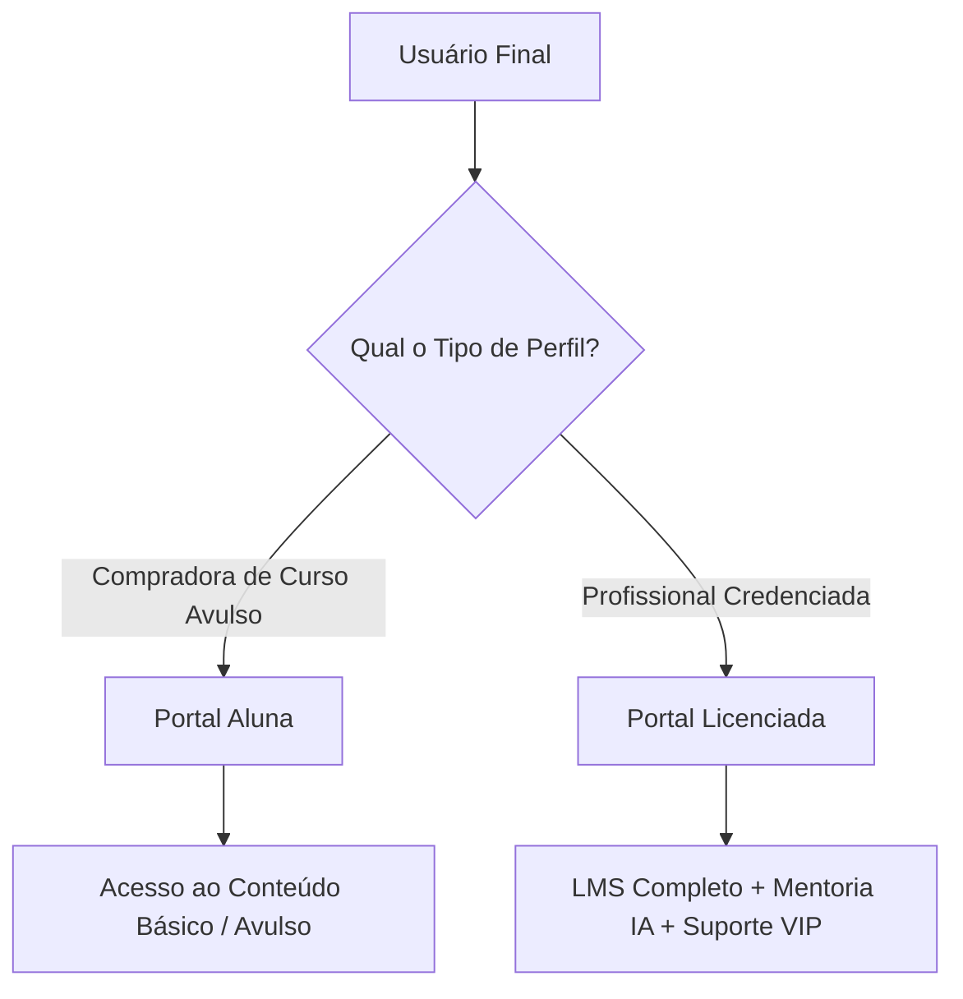
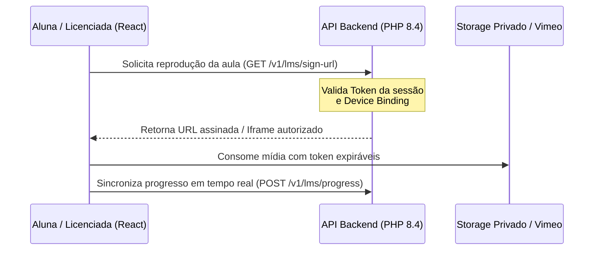

# 🎓 09-LMS-System-Purpose-Context (Nexus Era)

> **Status:** Active / Finalized  
> **Versão:** 3.1  
> **Governança:** OpenSpec V3.1 (Nexus Mode)  
> **Público-Alvo:** Desenvolvedores e Engenheiros do Ecossistema Body Harmony

---

## 1. Visão Geral do Sistema LMS

O **LMS (Learning Management System)** do ecossistema **Body Harmony** é um ecossistema educacional fechado e de alta performance, desenhado especificamente para entregar conteúdo técnico, mercadológico e profissional a duas classes distintas de usuárias: **Licenciadas** e **Alunas**.

O propósito do LMS vai muito além de um player de vídeos convencional. Ele funciona como uma ferramenta estratégica de transformação profissional, construída sobre os pilares de **segurança militarizada**, **experiência premium (Netflix-style)** e **rastreabilidade total**.

---

## 2. Proposta de Valor e Objetivos Críticos

O sistema foi estruturado para resolver desafios comuns no mercado de infoprodutos e cursos profissionais de alto ticket:

### 2.1. Proteção de Propriedade Intelectual (Zero Trust)
O principal ativo da marca Body Harmony é seu conteúdo pedagógico. Por isso, a arquitetura de segurança do LMS opera sob o modelo **Zero Trust**:
- **Device Authorization (Device Binding):** Limitação de dispositivos autenticados. O uso do mesmo token de acesso ou credencial por múltiplos aparelhos acarreta o bloqueio automático.
- **Rastreabilidade Forense:** Cada acesso, download e visualização de aula é registrado em tempo real na Timeline do Nexus Admin.
- **Exclusividade de Mídia:** Entrega de vídeo e arquivos controlada via endpoints do backend, com links assinados e verificação de sessões para impedir scrapers ou compartilhamento de links diretos.

### 2.2. Experiência de Uso Fluida e Premium
Alinhado com a **Identidade Visual V3.1**, o portal do aluno aplica cores e contrastes rigorosamente selecionados (`Navy Blue #0A3E60`, `Gold #ED7E13`, e `Superfície #FFFFFF`). A interface prioriza:
- **Design Responsivo & Mobile-First:** Navegação rápida em redes 3G/4G com consumo otimizado de pacotes de dados.
- **Progresso Contínuo:** Gravação contínua do progresso do aluno para retorno automático ao exato minuto em que a aula foi interrompida ("Continuar Assistindo").
- **Offline Resilience:** Uso de filas locais (`localStorage`) para registrar o progresso mesmo em momentos de oscilação severa de internet.

---

## 3. Arquitetura de Atores (Perfil de Usuários)

A arquitetura de controle de acesso (RBAC) divide o LMS em dois portais principais com fluxos de trabalho isolados:

### 3.1. Aluna (Curso Individual)
- **Perfil:** Usuária que comprou um curso individual ou pacote pontual.
- **Acesso:** Limitado ao conteúdo pedagógico das aulas compradas.
- **Experiência:** Foco em conclusão e suporte automatizado.

### 3.2. Licenciada (Credenciada)
- **Perfil:** Profissional que concluiu a formação avançada e possui licença ativa para exercer o método.
- **Acesso:** LMS Avançado, Biblioteca de Recursos Premium, Quizzes de Nivelamento, Gerador de Certificados.
- **Recursos Exclusivos:**
  - **Mentoria IA (Doctor Harmony):** Consulta de casos clínicos em tempo real orientados por inteligência artificial.
  - **Exposição na Galeria Pública:** Perfil completo exibido para pacientes locais no mapa do site institucional.

---

## 4. Estrutura de Módulos e Componentes Técnicos

O LMS foi desenvolvido utilizando uma stack moderna e limpa: **React (Frontend)** e **PHP 8.4 Vanilla (Backend)**.

### 4.1. Hierarquia de Conteúdo
1. **Trilha (Curso):** Área de aprendizado que agrupa múltiplos módulos.
2. **Módulos (`lms_modules`):** Divisão temática pedagógica do curso.
3. **Aulas (`lms_lessons`):** Unidade atômica do conteúdo contendo vídeo, texto de apoio e materiais complementares.
4. **Anexos (`lms_attachments`):** PDFs e materiais de leitura vinculados à aula.
5. **Avaliações (Quizzes):** Testes de múltipla escolha para validação de retenção do conhecimento.

### 4.2. Fluxo Técnico de Autenticação e Consumo de Mídia

---

## 5. Governança e Evolução

Com o advento do **Nexus Protocol V3.1**, todas as melhorias e correções no sistema LMS passam obrigatoriamente por auditoria prévia e documentação. Qualquer alteração em endpoints de progresso, segurança ou fluxo de mídia deve ser validada e registrada na master de segurança do sistema.
