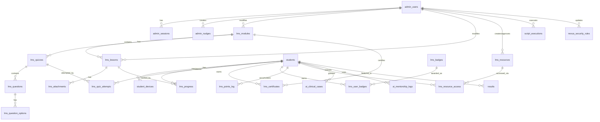

# 🗄️ Database Schema Documentation - Body Harmony v68

**Version:** 68.0.0  
**Last Updated:** 2026-03-02  
**Source:** `database_master_v1.sql`  
**Engine:** MySQL/InnoDB  
**Charset:** utf8mb4_unicode_ci

---

## 📊 Schema Overview

**Total Tables:** 42  
**Categories:**

- **Admin & Auth:** 3 tables
- **AI & Doctor Harmony:** 3 tables
- **LMS (Learning Management):** 16 tables
- **Aluna Portal (Cursos Avulsos):** 5 tables
- **Content & Media:** 7 tables
- **Security & Audit:** 4 tables
- **System & Config:** 4 tables

---

## 1️⃣ Admin & Authentication

### `admin_users`

**Purpose:** Administrative users (Superadmin, Admin, Editor)

| Column          | Type         | Constraints               | Description                     |
| :-------------- | :----------- | :------------------------ | :------------------------------ |
| `id`            | INT(11)      | PK, AUTO_INCREMENT        | Unique admin ID                 |
| `username`      | VARCHAR(50)  | UNIQUE, NOT NULL          | Login username                  |
| `password_hash` | VARCHAR(255) | NOT NULL                  | Bcrypt hashed password          |
| `role`          | ENUM         | DEFAULT 'admin'           | superadmin, admin, editor       |
| `lgpd_status`   | TEXT         | DEFAULT NULL              | JSON object with consent status |
| `created_at`    | TIMESTAMP    | DEFAULT CURRENT_TIMESTAMP | Account creation date           |

**Indexes:**

- PRIMARY KEY (`id`)
- UNIQUE KEY (`username`)

**Relationships:**

- Referenced by: `admin_sessions`, `nexus_security_rules`, `lms_modules`, `lms_lessons`

---

### `admin_sessions`

**Purpose:** Active admin session tokens (JWT alternative)

| Column       | Type        | Constraints                | Description            |
| :----------- | :---------- | :------------------------- | :--------------------- |
| `id`         | INT(11)     | PK, AUTO_INCREMENT         | Session ID             |
| `user_id`    | INT(11)     | FK → admin_users, NOT NULL | Admin user ID          |
| `token`      | VARCHAR(64) | UNIQUE, NOT NULL           | Session token (SHA256) |
| `expires_at` | DATETIME    | NOT NULL                   | Token expiration       |
| `created_at` | TIMESTAMP   | DEFAULT CURRENT_TIMESTAMP  | Session start          |

**Indexes:**

- PRIMARY KEY (`id`)
- UNIQUE KEY (`token`)
- KEY (`user_id`)

---

### `admin_nudges`

**Purpose:** Admin-to-student notifications/reminders

| Column          | Type       | Constraints                | Description                    |
| :-------------- | :--------- | :------------------------- | :----------------------------- |
| `id`            | INT(11)    | PK, AUTO_INCREMENT         | Nudge ID                       |
| `licenciada_id` | INT(11)    | FK → licenciadas, NOT NULL | Target student                 |
| `type`          | ENUM       | NOT NULL                   | alert, reminder, encouragement |
| `message`       | TEXT       | NOT NULL                   | Notification content           |
| `is_read`       | TINYINT(1) | DEFAULT 0                  | Read status                    |
| `created_at`    | TIMESTAMP  | DEFAULT CURRENT_TIMESTAMP  | Creation date                  |

**Indexes:**

- PRIMARY KEY (`id`)
- KEY (`licenciada_id`)

---

## 2️⃣ AI & Doctor Harmony

### `ai_config`

**Purpose:** Doctor Harmony AI configuration (Gemini & Nvidia API Gateway)

| Column         | Type         | Constraints                 | Description                |
| :------------- | :----------- | :-------------------------- | :------------------------- |
| `id`           | INT(11)      | PK, AUTO_INCREMENT          | Config ID                  |
| `config_key`   | VARCHAR(50)  | UNIQUE, NOT NULL            | Configuration key          |
| `config_value` | TEXT         | NULL                        | Configuration value (JSON) |
| `description`  | VARCHAR(255) | NULL                        | Human-readable description |
| `updated_at`   | TIMESTAMP    | ON UPDATE CURRENT_TIMESTAMP | Last update                |

**Indexes:**

- PRIMARY KEY (`id`)
- UNIQUE KEY (`config_key`)

**Sample Keys:**

- `ai_name`: "Doctor Harmony"
- `ai_slogan`: "Sua mentora técnica em fisiologia estética"
- `gemini_model`: "gemini-2.0-flash"
- `system_prompt`: AI behavior instructions

---

### `ai_clinical_cases`

**Purpose:** Student clinical case submissions for AI analysis

| Column             | Type         | Constraints                 | Description                           |
| :----------------- | :----------- | :-------------------------- | :------------------------------------ |
| `id`               | INT(11)      | PK, AUTO_INCREMENT          | Case ID                               |
| `license_id`       | INT(11)      | FK → licenciadas, NOT NULL  | Student ID                            |
| `licenciada_id`    | INT(11)      | FK → licenciadas, NOT NULL  | Student ID (duplicate?)               |
| `case_title`       | VARCHAR(255) | DEFAULT 'Caso Clínico'      | Case title                            |
| `case_description` | TEXT         | NULL                        | Case details                          |
| `photo_path`       | VARCHAR(255) | NULL                        | Clinical photo path                   |
| `ana_response`     | TEXT         | NULL                        | AI analysis response                  |
| `confidence_score` | FLOAT        | DEFAULT 0                   | AI confidence (0-1)                   |
| `needs_review`     | TINYINT(1)   | DEFAULT 0                   | Requires human review                 |
| `mentor_feedback`  | TEXT         | NULL                        | Human mentor feedback                 |
| `mentor_id`        | INT(11)      | FK → admin_users, NULL      | Reviewing mentor                      |
| `status`           | ENUM         | DEFAULT 'PENDING'           | PENDING, ANALYZED, REVIEWED, REJECTED |
| `created_at`       | TIMESTAMP    | DEFAULT CURRENT_TIMESTAMP   | Submission date                       |
| `updated_at`       | TIMESTAMP    | ON UPDATE CURRENT_TIMESTAMP | Last update                           |

**Indexes:**

- PRIMARY KEY (`id`)
- KEY (`license_id`)
- KEY (`licenciada_id`)

---

### `ai_mentorship_logs`

**Purpose:** Doctor Harmony usage tracking (credits/tokens)

| Column              | Type         | Constraints                | Description            |
| :------------------ | :----------- | :------------------------- | :--------------------- |
| `id`                | INT(11)      | PK, AUTO_INCREMENT         | Log ID                 |
| `license_id`        | INT(11)      | FK → licenciadas, NOT NULL | Student ID             |
| `interaction_type`  | ENUM         | NOT NULL                   | TEXT, VISION           |
| `image_path`        | VARCHAR(255) | NULL                       | Image path (if VISION) |
| `prompt_tokens`     | INT(11)      | DEFAULT 0                  | Input tokens consumed  |
| `completion_tokens` | INT(11)      | DEFAULT 0                  | Output tokens consumed |
| `created_at`        | TIMESTAMP    | DEFAULT CURRENT_TIMESTAMP  | Interaction date       |

**Indexes:**

- PRIMARY KEY (`id`)
- KEY (`license_id`)

---

## 3️⃣ LMS (Learning Management System)

### `lms_modules`

**Purpose:** Course modules (top-level organization)

| Column             | Type         | Constraints               | Description        |
| :----------------- | :----------- | :------------------------ | :----------------- |
| `id`               | INT(11)      | PK, AUTO_INCREMENT        | Module ID          |
| `title`            | VARCHAR(150) | NOT NULL                  | Module title       |
| `description`      | TEXT         | NULL                      | Module description |
| `thumbnail_url`    | VARCHAR(255) | NULL                      | Module cover image |
| `display_order`    | INT(11)      | DEFAULT 0                 | Sort order         |
| `is_active`        | TINYINT(1)   | DEFAULT 1                 | Visibility status  |
| `is_exclusive`     | TINYINT(1)   | DEFAULT 0                 | Exclusive content flag |
| `last_modified_by` | INT(11)      | FK → admin_users, NULL    | Last editor        |
| `last_modified_at` | TIMESTAMP    | NULL                      | Last edit date     |
| `created_at`       | TIMESTAMP    | DEFAULT CURRENT_TIMESTAMP | Creation date      |

**Indexes:**

- PRIMARY KEY (`id`)
- KEY (`last_modified_by`)

**Current Modules (v34):**

1. Introdução ao Body Harmony
2. Fundamentos da Eletroestimulação
3. Interpretação de exames - DR ULISSES LOPES
4. EletroFace - Aula teórica e fundamentos
5. Negócios/Marketing
6. Aulas Práticas

---

### `lms_lessons`

**Purpose:** Individual lessons/classes within modules

| Column             | Type         | Constraints                | Description                           |
| :----------------- | :----------- | :------------------------- | :------------------------------------ |
| `id`               | INT(11)      | PK, AUTO_INCREMENT         | Lesson ID                             |
| `module_id`        | INT(11)      | FK → lms_modules, NOT NULL | Parent module                         |
| `title`            | VARCHAR(150) | NOT NULL                   | Lesson title                          |
| `description`      | TEXT         | NULL                       | Lesson description                    |
| `video_type`       | ENUM         | DEFAULT 'youtube'          | youtube, vimeo, mp4, bunny, hostinger |
| `video_url`        | VARCHAR(255) | NULL                       | Video URL/path                        |
| `duration_seconds` | INT(11)      | DEFAULT 0                  | Video duration                        |
| `thumbnail_url`    | VARCHAR(255) | NULL                       | Lesson thumbnail                      |
| `file_path`        | VARCHAR(255) | NULL                       | File path (if hostinger)              |
| `display_order`    | INT(11)      | DEFAULT 0                  | Sort order                            |
| `is_active`        | TINYINT(1)   | DEFAULT 1                  | Visibility status                     |
| `allow_preview`    | TINYINT(1)   | DEFAULT 0                  | Free preview allowed                  |
| `points_reward`    | INT(11)      | DEFAULT 10                 | Gamification points                   |
| `views_count`      | INT(11)      | DEFAULT 0                  | Total views                           |
| `last_modified_by` | INT(11)      | FK → admin_users, NULL     | Last editor                           |
| `last_modified_at` | TIMESTAMP    | NULL                       | Last edit date                        |
| `created_at`       | TIMESTAMP    | DEFAULT CURRENT_TIMESTAMP  | Creation date                         |

**Indexes:**

- PRIMARY KEY (`id`)
- KEY (`module_id`)
- KEY (`last_modified_by`)

---

### `lms_progress`

**Purpose:** Student progress tracking per lesson

| Column             | Type       | Constraints                | Description                 |
| :----------------- | :--------- | :------------------------- | :-------------------------- |
| `id`               | INT(11)    | PK, AUTO_INCREMENT         | Progress ID                 |
| `licenciada_id`    | INT(11)    | FK → licenciadas, NOT NULL | Licenciada ID               |
| `lesson_id`        | INT(11)    | FK → lms_lessons, NOT NULL | Lesson ID                   |
| `is_completed`     | TINYINT(1) | DEFAULT 0                  | Completion status           |
| `progress_percent` | INT(11)    | DEFAULT 0                  | Progress percentage (0-100) |
| `total_duration`   | INT(11)    | DEFAULT 0                  | Total video duration        |
| `watched_duration` | INT(11)    | DEFAULT 0                  | Watched duration (seconds)  |
| `completion_date`  | TIMESTAMP  | NULL                       | Completion timestamp        |
| `last_watched_at`  | TIMESTAMP  | NULL                       | Last view timestamp         |

**Indexes:**

- PRIMARY KEY (`id`)
- UNIQUE KEY (`licenciada_id`, `lesson_id`)
- KEY (`lesson_id`)

---

### `lms_attachments`

**Purpose:** Lesson supplementary materials

| Column       | Type         | Constraints                | Description           |
| :----------- | :----------- | :------------------------- | :-------------------- |
| `id`         | INT(11)      | PK, AUTO_INCREMENT         | Attachment ID         |
| `lesson_id`  | INT(11)      | FK → lms_lessons, NOT NULL | Parent lesson         |
| `type`       | ENUM         | NOT NULL                   | pdf, doc, link, image |
| `title`      | VARCHAR(150) | NOT NULL                   | Attachment title      |
| `url`        | VARCHAR(255) | NOT NULL                   | File URL/path         |
| `created_at` | TIMESTAMP    | DEFAULT CURRENT_TIMESTAMP  | Upload date           |

**Indexes:**

- PRIMARY KEY (`id`)
- KEY (`lesson_id`)

---

### `lms_quizzes`

**Purpose:** Module quizzes/assessments

| Column        | Type         | Constraints                | Description               |
| :------------ | :----------- | :------------------------- | :------------------------ |
| `id`          | INT(11)      | PK, AUTO_INCREMENT         | Quiz ID                   |
| `module_id`   | INT(11)      | FK → lms_modules, NOT NULL | Parent module             |
| `title`       | VARCHAR(150) | NOT NULL                   | Quiz title                |
| `description` | TEXT         | NULL                       | Quiz description          |
| `min_score`   | INT(11)      | DEFAULT 70                 | Minimum passing score (%) |
| `created_at`  | TIMESTAMP    | DEFAULT CURRENT_TIMESTAMP  | Creation date             |

**Indexes:**

- PRIMARY KEY (`id`)
- KEY (`module_id`)

---

### `lms_questions`

**Purpose:** Quiz questions

| Column        | Type         | Constraints                | Description            |
| :------------ | :----------- | :------------------------- | :--------------------- |
| `id`          | INT(11)      | PK, AUTO_INCREMENT         | Question ID            |
| `quiz_id`     | INT(11)      | FK → lms_quizzes, NOT NULL | Parent quiz            |
| `text`        | TEXT         | NOT NULL                   | Question text          |
| `type`        | ENUM         | DEFAULT 'single'           | single, multiple, text |
| `order_index` | INT(11)      | DEFAULT 0                  | Display order          |
| `image_ref`   | VARCHAR(255) | NULL                       | Question image         |
| `created_at`  | TIMESTAMP    | DEFAULT CURRENT_TIMESTAMP  | Creation date          |

**Indexes:**

- PRIMARY KEY (`id`)
- KEY (`quiz_id`)

---

### `lms_question_options`

**Purpose:** Multiple choice options

| Column        | Type       | Constraints                  | Description         |
| :------------ | :--------- | :--------------------------- | :------------------ |
| `id`          | INT(11)    | PK, AUTO_INCREMENT           | Option ID           |
| `question_id` | INT(11)    | FK → lms_questions, NOT NULL | Parent question     |
| `text`        | TEXT       | NOT NULL                     | Option text         |
| `is_correct`  | TINYINT(1) | DEFAULT 0                    | Correct answer flag |
| `created_at`  | TIMESTAMP  | DEFAULT CURRENT_TIMESTAMP    | Creation date       |

**Indexes:**

- PRIMARY KEY (`id`)
- KEY (`question_id`)

---

### `lms_quiz_attempts`

**Purpose:** Student quiz submissions

| Column          | Type         | Constraints                | Description      |
| :-------------- | :----------- | :------------------------- | :--------------- |
| `id`            | INT(11)      | PK, AUTO_INCREMENT         | Attempt ID       |
| `licenciada_id` | INT(11)      | FK → licenciadas, NOT NULL | Licenciada ID    |
| `quiz_id`       | INT(11)      | FK → lms_quizzes, NOT NULL | Quiz ID          |
| `score`         | DECIMAL(5,2) | DEFAULT 0.00               | Score percentage |
| `passed`        | TINYINT(1)   | DEFAULT 0                  | Pass/fail status |
| `answers_json`  | LONGTEXT     | NULL                       | JSON of answers  |
| `attempted_at`  | TIMESTAMP    | DEFAULT CURRENT_TIMESTAMP  | Attempt date     |

**Indexes:**

- PRIMARY KEY (`id`)
- KEY (`licenciada_id`)
- KEY (`quiz_id`)

---

### `lms_certificates`

**Purpose:** Module completion certificates

| Column          | Type         | Constraints                | Description       |
| :-------------- | :----------- | :------------------------- | :---------------- |
| `id`            | INT(11)      | PK, AUTO_INCREMENT         | Certificate ID    |
| `licenciada_id` | INT(11)      | FK → licenciadas, NOT NULL | Licenciada ID     |
| `module_id`     | INT(11)      | FK → lms_modules, NOT NULL | Module ID         |
| `hash_code`     | VARCHAR(64)  | UNIQUE, NOT NULL           | Verification hash |
| `issued_at`     | TIMESTAMP    | DEFAULT CURRENT_TIMESTAMP  | Issue date        |
| `pdf_url`       | VARCHAR(255) | NULL                       | PDF download URL  |

**Indexes:**

- PRIMARY KEY (`id`)
- UNIQUE KEY (`licenciada_id`, `module_id`)
- UNIQUE KEY (`hash_code`)
- KEY (`module_id`)

---

### `lms_resources`

**Purpose:** Downloadable library resources

| Column        | Type         | Constraints               | Description                                    |
| :------------ | :----------- | :------------------------ | :--------------------------------------------- |
| `id`          | INT(11)      | PK, AUTO_INCREMENT        | Resource ID                                    |
| `title`       | VARCHAR(150) | NOT NULL                  | Resource title                                 |
| `file_name`   | VARCHAR(255) | NULL                      | Original filename                              |
| `description` | TEXT         | NULL                      | Resource description                           |
| `file_type`   | VARCHAR(20)  | DEFAULT 'pdf'             | File extension                                 |
| `size_bytes`  | BIGINT(20)   | DEFAULT 0                 | File size                                      |
| `status`      | ENUM         | DEFAULT 'approved'        | pending, approved, rejected                    |
| `category`    | ENUM         | DEFAULT 'other'           | manual, evaluation, marketing, template, other |
| `created_by`  | INT(11)      | FK → admin_users, NULL    | Uploader                                       |
| `approved_by` | INT(11)      | FK → admin_users, NULL    | Approver                                       |
| `file_path`   | VARCHAR(255) | NOT NULL                  | Storage path                                   |
| `is_active`   | TINYINT(1)   | DEFAULT 1                 | Visibility status                              |
| `created_at`  | TIMESTAMP    | DEFAULT CURRENT_TIMESTAMP | Upload date                                    |

**Indexes:**

- PRIMARY KEY (`id`)
- KEY (`created_by`)
- KEY (`approved_by`)

---

### `lms_resource_access`

**Purpose:** Student-specific resource permissions

| Column          | Type     | Constraints                  | Description    |
| :-------------- | :------- | :--------------------------- | :------------- |
| `id`            | INT(11)  | PK, AUTO_INCREMENT           | Access ID      |
| `resource_id`   | INT(11)  | FK → lms_resources, NOT NULL | Resource ID    |
| `licenciada_id` | INT(11)  | FK → licenciadas, NOT NULL   | Licenciada ID  |
| `granted_at`    | DATETIME | DEFAULT CURRENT_TIMESTAMP    | Grant date     |
| `granted_by`    | INT(11)  | FK → admin_users, NULL       | Granting admin |

**Indexes:**

- PRIMARY KEY (`id`)
- UNIQUE KEY (`resource_id`, `licenciada_id`)
- KEY (`licenciada_id`)
- KEY (`granted_by`)

---

### `licenciada_course_access`

**Purpose:** Licenciada-specific module permissions (exclusive content access)

| Column          | Type     | Constraints                | Description     |
| :-------------- | :------- | :------------------------- | :-------------- |
| `id`            | INT(11)  | PK, AUTO_INCREMENT         | Access ID       |
| `licenciada_id` | INT(11)  | FK → licenciadas, CASCADE  | Licenciada ID   |
| `module_id`     | INT(11)  | FK → lms_modules, CASCADE  | Module ID       |
| `granted_at`    | DATETIME | DEFAULT CURRENT_TIMESTAMP  | Date granted    |
| `granted_by`    | INT(11)  | FK → admin_users, SET NULL | Granting admin  |
| `expires_at`    | DATETIME | NULL                      | Optional expiry |

**Indexes:**

- PRIMARY KEY (`id`)
- UNIQUE KEY (`licenciada_id`, `module_id`)
- KEY (`module_id`)
- KEY (`granted_by`)

---

### `lms_badges`

**Purpose:** Gamification badges definitions

| Column          | Type         | Constraints               | Description             |
| :-------------- | :----------- | :------------------------ | :---------------------- |
| `id`            | INT(11)      | PK, AUTO_INCREMENT        | Badge ID                |
| `name`          | VARCHAR(100) | NOT NULL                  | Badge name              |
| `slug`          | VARCHAR(50)  | NOT NULL                  | URL-friendly slug       |
| `description`   | TEXT         | NULL                      | Badge description       |
| `icon_url`      | VARCHAR(255) | NULL                      | Badge icon              |
| `criteria_json` | LONGTEXT     | NULL                      | Earning criteria (JSON) |
| `created_at`    | TIMESTAMP    | DEFAULT CURRENT_TIMESTAMP | Creation date           |

**Indexes:**

- PRIMARY KEY (`id`)

---

### `lms_user_badges`

**Purpose:** Student earned badges

| Column          | Type      | Constraints                | Description   |
| :-------------- | :-------- | :------------------------- | :------------ |
| `id`            | INT(11)   | PK, AUTO_INCREMENT         | Award ID      |
| `licenciada_id` | INT(11)   | FK → licenciadas, NOT NULL | Licenciada ID |
| `badge_id`      | INT(11)   | FK → lms_badges, NOT NULL  | Badge ID      |
| `awarded_at`    | TIMESTAMP | DEFAULT CURRENT_TIMESTAMP  | Award date    |

**Indexes:**

- PRIMARY KEY (`id`)
- UNIQUE KEY (`licenciada_id`, `badge_id`)
- KEY (`badge_id`)

---

### `lms_points_log`

**Purpose:** Gamification points history

| Column          | Type        | Constraints                | Description       |
| :-------------- | :---------- | :------------------------- | :---------------- |
| `id`            | INT(11)     | PK, AUTO_INCREMENT         | Log ID            |
| `licenciada_id` | INT(11)     | FK → licenciadas, NOT NULL | Licenciada ID     |
| `action`        | VARCHAR(50) | NOT NULL                   | Action type       |
| `points`        | INT(11)     | NOT NULL                   | Points awarded    |
| `reference_id`  | INT(11)     | NULL                       | Related entity ID |
| `created_at`    | TIMESTAMP   | DEFAULT CURRENT_TIMESTAMP  | Award date        |

**Indexes:**

- PRIMARY KEY (`id`)
- KEY (`licenciada_id`)

---

### `lms_access_logs`

**Purpose:** LMS activity audit trail

| Column            | Type         | Constraints               | Description                      |
| :---------------- | :----------- | :------------------------ | :------------------------------- |
| `id`              | INT(11)      | PK, AUTO_INCREMENT        | Log ID                           |
| `licenciada_id`   | INT(11)      | FK → licenciadas, NULL    | Licenciada ID                    |
| `admin_id`        | INT(11)      | FK → admin_users, NULL    | Admin ID                         |
| `user_type`       | ENUM         | NOT NULL                  | licenciada, admin, system        |
| `action`          | VARCHAR(50)  | NOT NULL                  | Action performed                 |
| `target_resource` | VARCHAR(100) | NULL                      | Target resource                  |
| `details`         | TEXT         | NULL                      | Additional details               |
| `ip_address`      | VARCHAR(45)  | NULL                      | IP address                       |
| `user_agent`      | TEXT         | NULL                      | Browser User Agent (Nexus V66.5) |
| `created_at`      | TIMESTAMP    | DEFAULT CURRENT_TIMESTAMP | Action date                      |

**Indexes:**

- PRIMARY KEY (`id`)
- KEY (`licenciada_id`)
- KEY (`admin_id`)
- KEY (`user_type`)

---

## 4️⃣ Aluna Portal (Cursos Avulsos)

### `alunas`

**Purpose:** Customers who purchase individual courses (isolated from licenciadas)

| Column                  | Type         | Constraints               | Description        |
| :---------------------- | :----------- | :------------------------ | :----------------- |
| `id`                    | INT(11)      | PK, AUTO_INCREMENT        | Unique aluna ID    |
| `name`                  | VARCHAR(100) | NOT NULL                  | Full name          |
| `email`                 | VARCHAR(100) | UNIQUE, NOT NULL          | Email address      |
| `cpf`                   | VARCHAR(14)  | UNIQUE, NOT NULL          | Tax ID             |
| `password_hash`         | VARCHAR(255) | NOT NULL                  | Bcrypt hash        |
| `is_active`             | TINYINT(1)   | DEFAULT 1                 | Account status     |
| `force_password_change` | TINYINT(1)   | DEFAULT 1                 | Initial login flag |
| `admin_notes`           | TEXT         | NULL                      | System notes       |
| `lgpd_status`           | TEXT         | NULL                      | Consent status     |
| `created_at`            | TIMESTAMP    | DEFAULT CURRENT_TIMESTAMP | Creation date      |

**Indexes:**

- PRIMARY KEY (`id`)
- UNIQUE KEY (`email`)
- UNIQUE KEY (`cpf`)

---

### `aluna_devices`

**Purpose:** Multi-session control and fingerprinting for alunas

| Column             | Type        | Constraints          | Description       |
| :----------------- | :---------- | :------------------- | :---------------- |
| `id`               | INT(11)     | PK, AUTO_INCREMENT   | Device ID         |
| `aluna_id`         | INT(11)     | FK → alunas, CASCADE | Owner             |
| `device_token`     | VARCHAR(64) | UNIQUE, NOT NULL     | Session token     |
| `fingerprint_hash` | VARCHAR(64) | NULL                 | Hardware hash     |
| `is_active`        | TINYINT(1)  | DEFAULT 1            | Status            |
| `last_used_at`     | TIMESTAMP   | ON UPDATE            | Activity tracking |

**Indexes:**

- PRIMARY KEY (`id`)
- UNIQUE KEY (`device_token`)
- KEY (`aluna_id`)

---

### `aluna_course_access`

**Purpose:** Individual course permissions (Module-based)

| Column       | Type     | Constraints               | Description     |
| :----------- | :------- | :------------------------ | :-------------- |
| `id`         | INT(11)  | PK, AUTO_INCREMENT        | Access ID       |
| `aluna_id`   | INT(11)  | FK → alunas, CASCADE      | Aluna           |
| `module_id`  | INT(11)  | FK → lms_modules, CASCADE | Granted course  |
| `granted_at` | DATETIME | CURRENT_TIMESTAMP         | Date granted    |
| `expires_at` | DATETIME | NULL                      | Optional expiry |

**Indexes:**

- PRIMARY KEY (`id`)
- UNIQUE KEY (`aluna_id`, `module_id`)

---

### `aluna_progress`

**Purpose:** Tracking lessons watched by alunas

| Column             | Type       | Constraints               | Description     |
| :----------------- | :--------- | :------------------------ | :-------------- |
| `id`               | INT(11)    | PK, AUTO_INCREMENT        | Progress ID     |
| `aluna_id`         | INT(11)    | FK → alunas, CASCADE      | Aluna           |
| `lesson_id`        | INT(11)    | FK → lms_lessons, CASCADE | Lesson          |
| `is_completed`     | TINYINT(1) | DEFAULT 0                 | Done flag       |
| `progress_percent` | INT(11)    | DEFAULT 0                 | % of video      |
| `watched_duration` | INT(11)    | DEFAULT 0                 | Seconds watched |
| `completion_date`  | TIMESTAMP  | NULL                      | Finished date   |

**Indexes:**

- PRIMARY KEY (`id`)
- UNIQUE KEY (`aluna_id`, `lesson_id`)

---

### `aluna_certificates`

**Purpose:** Proof of completion for alunas

| Column      | Type         | Constraints               | Description     |
| :---------- | :----------- | :------------------------ | :-------------- |
| `id`        | INT(11)      | PK, AUTO_INCREMENT        | Cert ID         |
| `aluna_id`  | INT(11)      | FK → alunas, CASCADE      | Owner           |
| `module_id` | INT(11)      | FK → lms_modules, CASCADE | Subject         |
| `hash_code` | VARCHAR(64)  | UNIQUE, NOT NULL          | Anti-fraud hash |
| `pdf_url`   | VARCHAR(255) | NULL                      | File location   |

**Indexes:**

- PRIMARY KEY (`id`)
- UNIQUE KEY (`aluna_id`, `module_id`)
- UNIQUE KEY (`hash_code`)

---

## 5️⃣ Licenciadas & Users

### `licenciadas`

**Purpose:** Licensed professionals (LMS users)

| Column                  | Type         | Constraints               | Description                     |
| :---------------------- | :----------- | :------------------------ | :------------------------------ |
| `id`                    | INT(11)      | PK, AUTO_INCREMENT        | Licenciada ID                   |
| `name`                  | VARCHAR(100) | NOT NULL                  | Full name                       |
| `email`                 | VARCHAR(100) | UNIQUE, NULL              | Email address                   |
| `username`              | VARCHAR(50)  | UNIQUE, NULL              | Login username                  |
| `cpf`                   | VARCHAR(14)  | NOT NULL                  | C.P.F. para Fallback de Login   |
| `state`                 | VARCHAR(10)  | NULL                      | Brazilian state (UF)            |
| `location`              | VARCHAR(100) | NULL                      | City/location                   |
| `photo_url`             | VARCHAR(255) | NULL                      | Profile photo                   |
| `whatsapp`              | VARCHAR(20)  | NULL                      | WhatsApp number                 |
| `instagram`             | VARCHAR(50)  | NULL                      | Instagram handle                |
| `instagram_embed_url`   | VARCHAR(255) | NULL                      | Instagram embed URL             |
| `password_hash`         | VARCHAR(255) | NULL                      | Bcrypt hashed password          |
| `force_password_change` | TINYINT(1)   | DEFAULT 0                 | First login flag                |
| `video_url`             | VARCHAR(255) | NULL                      | Testimonial video               |
| `mini_gallery`          | TEXT         | NULL                      | JSON gallery images             |
| `max_devices`           | INT(11)      | DEFAULT 1                 | Device limit                    |
| `is_active`             | TINYINT(1)   | DEFAULT 1                 | Account status                  |
| `failed_login_attempts` | TINYINT(4)   | DEFAULT 0                 | Failed login counter            |
| `locked_until`          | DATETIME     | NULL                      | Account lock expiry             |
| `last_login_at`         | DATETIME     | NULL                      | Last login timestamp            |
| `last_watched_at`       | TIMESTAMP    | NULL                      | Last lesson view                |
| `progress_percent`      | DECIMAL(5,2) | DEFAULT 0.00              | Overall progress                |
| `created_at`            | TIMESTAMP    | DEFAULT CURRENT_TIMESTAMP | Account creation                |
| `renewal_date`          | DATE         | NULL                      | License renewal date            |
| `admin_notes`           | TEXT         | NULL                      | Admin notes                     |
| `lgpd_status`           | TEXT         | NULL                      | JSON object with consent status |

**Indexes:**

- PRIMARY KEY (`id`)
- UNIQUE KEY (`username`)
- UNIQUE KEY (`email`)
- KEY (`renewal_date`)

---

### `licenciada_devices`

**Purpose:** Device fingerprinting and location tracking for behavioral analysis (WATCHTOWER 2.0).

| Column             | Type         | Constraints                 | Description           |
| :----------------- | :----------- | :-------------------------- | :-------------------- |
| `id`               | INT(11)      | PK, AUTO_INCREMENT          | Device ID             |
| `licenciada_id`    | INT(11)      | NOT NULL                    | Licenciada ID         |
| `device_token`     | VARCHAR(64)  | UNIQUE, NOT NULL            | Device fingerprint    |
| `user_agent`       | VARCHAR(255) | NULL                        | Browser user agent    |
| `ip_address`       | VARCHAR(45)  | NULL                        | IP address            |
| `is_active`        | TINYINT(1)   | DEFAULT 1                   | Device status         |
| `is_trusted`       | TINYINT(1)   | DEFAULT 0                   | Admin-granted trust   |
| `city`             | VARCHAR(100) | NULL                        | Geolocation: City     |
| `region`           | VARCHAR(100) | NULL                        | Geolocation: Region   |
| `isp`              | VARCHAR(100) | NULL                        | ISP Name              |
| `fingerprint_hash` | VARCHAR(64)  | NULL                        | Hardware/Browser Hash |
| `created_at`       | TIMESTAMP    | DEFAULT CURRENT_TIMESTAMP   | First seen            |
| `last_used_at`     | TIMESTAMP    | ON UPDATE CURRENT_TIMESTAMP | Last activity         |

**Indexes:**

- PRIMARY KEY (`id`)
- UNIQUE KEY (`device_token`)
- KEY (`licenciada_id`)
- KEY (`fingerprint_hash`)

---

## 6️⃣ Content & Media

### `media_files`

**Purpose:** Media file tracking and reuse system

| Column           | Type         | Constraints               | Description                                 |
| :--------------- | :----------- | :------------------------ | :------------------------------------------ |
| `id`             | INT(11)      | PK, AUTO_INCREMENT        | File ID                                     |
| `file_path`      | VARCHAR(500) | UNIQUE, NOT NULL          | Relative path from private_uploads/         |
| `file_name`      | VARCHAR(255) | NOT NULL                  | Original filename                           |
| `file_type`      | VARCHAR(100) | NOT NULL                  | MIME type                                   |
| `file_size`      | BIGINT(20)   | NOT NULL                  | Size in bytes                               |
| `media_category` | ENUM         | NOT NULL                  | thumbnail, lesson, resource, profile, other |
| `width`          | INT(11)      | NULL                      | Image width (px)                            |
| `height`         | INT(11)      | NULL                      | Image height (px)                           |
| `created_at`     | TIMESTAMP    | DEFAULT CURRENT_TIMESTAMP | Upload date                                 |
| `last_accessed`  | TIMESTAMP    | NULL                      | Last use timestamp                          |
| `access_count`   | INT(11)      | DEFAULT 0                 | Reuse counter                               |

**Indexes:**

- PRIMARY KEY (`id`)
- UNIQUE KEY (`file_path`)
- KEY (`media_category`)
- KEY (`created_at`)

---

### `mentors`

**Purpose:** Body Harmony mentors/instructors

| Column       | Type         | Constraints               | Description       |
| :----------- | :----------- | :------------------------ | :---------------- |
| `id`         | INT(11)      | PK, AUTO_INCREMENT        | Mentor ID         |
| `name`       | VARCHAR(100) | NOT NULL                  | Full name         |
| `nickname`   | VARCHAR(50)  | NULL                      | Display name      |
| `role`       | VARCHAR(100) | NULL                      | Professional role |
| `photo_url`  | VARCHAR(255) | NULL                      | Profile photo     |
| `bio`        | TEXT         | NULL                      | Biography         |
| `instagram`  | VARCHAR(50)  | NULL                      | Instagram handle  |
| `created_at` | TIMESTAMP    | DEFAULT CURRENT_TIMESTAMP | Creation date     |

**Indexes:**

- PRIMARY KEY (`id`)

**Current Mentors (v34):**

1. Joselene A. Silva (Josi) - Co-Fundadora
2. Dr. Ulisses Lopes - Médico Especialista
3. Kaprice Gonçalves - Educadora Física

---

### `testimonials`

**Purpose:** Student testimonials

| Column       | Type         | Constraints               | Description       |
| :----------- | :----------- | :------------------------ | :---------------- |
| `id`         | INT(11)      | PK, AUTO_INCREMENT        | Testimonial ID    |
| `name`       | VARCHAR(100) | NOT NULL                  | Student name      |
| `role`       | VARCHAR(100) | NULL                      | Professional role |
| `text`       | TEXT         | NOT NULL                  | Testimonial text  |
| `photo_url`  | VARCHAR(255) | NULL                      | Student photo     |
| `created_at` | TIMESTAMP    | DEFAULT CURRENT_TIMESTAMP | Creation date     |

**Indexes:**

- PRIMARY KEY (`id`)

---

### `results`

**Purpose:** Before/after transformation results

| Column          | Type         | Constraints                  | Description        |
| :-------------- | :----------- | :--------------------------- | :----------------- |
| `id`            | INT(11)      | PK, AUTO_INCREMENT           | Result ID          |
| `description`   | VARCHAR(255) | NOT NULL                     | Result description |
| `category`      | VARCHAR(50)  | DEFAULT 'Gordura Localizada' | Treatment category |
| `image_url`     | VARCHAR(255) | NOT NULL                     | Result image       |
| `date`          | DATE         | NULL                         | Treatment date     |
| `licenciada_id` | INT(11)      | FK → licenciadas, NULL       | Related licenciada |
| `pinned`        | TINYINT(1)   | DEFAULT 0                    | Featured result    |
| `created_at`    | TIMESTAMP    | DEFAULT CURRENT_TIMESTAMP    | Creation date      |

**Indexes:**

- PRIMARY KEY (`id`)
- KEY (`licenciada_id`)

---

### `gallery_images`

**Purpose:** General image gallery

| Column        | Type         | Constraints               | Description       |
| :------------ | :----------- | :------------------------ | :---------------- |
| `id`          | INT(11)      | PK, AUTO_INCREMENT        | Image ID          |
| `image_url`   | VARCHAR(255) | NOT NULL                  | Image URL         |
| `category`    | VARCHAR(50)  | DEFAULT 'General'         | Image category    |
| `description` | VARCHAR(255) | NULL                      | Image description |
| `is_active`   | TINYINT(1)   | DEFAULT 1                 | Visibility status |
| `created_at`  | TIMESTAMP    | DEFAULT CURRENT_TIMESTAMP | Upload date       |

**Indexes:**

- PRIMARY KEY (`id`)

---

### `leads`

**Purpose:** Contact form submissions

| Column       | Type         | Constraints               | Description                         |
| :----------- | :----------- | :------------------------ | :---------------------------------- |
| `id`         | INT(11)      | PK, AUTO_INCREMENT        | Lead ID                             |
| `name`       | VARCHAR(100) | NOT NULL                  | Contact name                        |
| `email`      | VARCHAR(100) | NOT NULL                  | Contact email                       |
| `whatsapp`   | VARCHAR(20)  | NULL                      | WhatsApp number                     |
| `status`     | ENUM         | DEFAULT 'new'             | new, contacted, converted, archived |
| `source`     | VARCHAR(50)  | DEFAULT 'site'            | Lead source                         |
| `notes`      | TEXT         | NULL                      | Admin notes                         |
| `created_at` | TIMESTAMP    | DEFAULT CURRENT_TIMESTAMP | Submission date                     |

**Indexes:**

- PRIMARY KEY (`id`)

---

### `faq`

**Purpose:** Frequently asked questions

| Column          | Type       | Constraints               | Description       |
| :-------------- | :--------- | :------------------------ | :---------------- |
| `id`            | INT(11)    | PK, AUTO_INCREMENT        | FAQ ID            |
| `question`      | TEXT       | NOT NULL                  | Question text     |
| `answer`        | TEXT       | NOT NULL                  | Answer text       |
| `display_order` | INT(11)    | DEFAULT 0                 | Sort order        |
| `is_active`     | TINYINT(1) | DEFAULT 1                 | Visibility status |
| `created_at`    | TIMESTAMP  | DEFAULT CURRENT_TIMESTAMP | Creation date     |

**Indexes:**

- PRIMARY KEY (`id`)

---

## 6️⃣ Security & Audit

### `nexus_security_rules`

**Purpose:** Nexus security configuration

| Column        | Type         | Constraints                 | Description                |
| :------------ | :----------- | :-------------------------- | :------------------------- |
| `id`          | INT(11)      | PK, AUTO_INCREMENT          | Rule ID                    |
| `rule_key`    | VARCHAR(50)  | UNIQUE, NOT NULL            | Rule identifier            |
| `rule_value`  | TEXT         | NULL                        | Rule value (JSON)          |
| `description` | VARCHAR(255) | NULL                        | Human-readable description |
| `is_active`   | TINYINT(1)   | DEFAULT 1                   | Rule status                |
| `updated_at`  | TIMESTAMP    | ON UPDATE CURRENT_TIMESTAMP | Last update                |
| `updated_by`  | INT(11)      | FK → admin_users, NULL      | Last editor                |

**Indexes:**

- PRIMARY KEY (`id`)
- UNIQUE KEY (`rule_key`)
- KEY (`updated_by`)

**Current Rules (v34):**

- `MAX_LOGIN_ATTEMPTS`: 3
- `LOCKOUT_DURATION_MINUTES`: 15
- `WHITELIST_IPS`: JSON array of allowed IPs
- `BLACKLIST_IPS`: JSON array of banned IPs
- `ALLOW_REGISTRATION`: "" (disabled)

---

### `audit_logs`

**Purpose:** System-wide audit trail

| Column        | Type        | Constraints               | Description            |
| :------------ | :---------- | :------------------------ | :--------------------- |
| `id`          | INT(11)     | PK, AUTO_INCREMENT        | Log ID                 |
| `user_id`     | INT(11)     | NOT NULL                  | User ID                |
| `user_type`   | ENUM        | NOT NULL                  | admin, student, system |
| `action`      | VARCHAR(50) | NOT NULL                  | Action performed       |
| `severity`    | VARCHAR(20) | DEFAULT 'INFO'            | Log severity           |
| `description` | TEXT        | NULL                      | Action description     |
| `details`     | JSON        | NULL                      | Additional details     |
| `ip_address`  | VARCHAR(45) | NULL                      | IP address             |
| `created_at`  | TIMESTAMP   | DEFAULT CURRENT_TIMESTAMP | Action date            |

**Indexes:**

- PRIMARY KEY (`id`)
- KEY (`severity`)
- KEY (`user_id`, `user_type`)

---

### `auth_logs`

**Purpose:** Authentication attempt logs with Risk Scoring (WATCHTOWER 2.0)

| Column         | Type         | Constraints               | Description              |
| :------------- | :----------- | :------------------------ | :----------------------- |
| `id`           | INT(11)      | PK, AUTO_INCREMENT        | Log ID                   |
| `email`        | VARCHAR(100) | NOT NULL                  | Login email/username     |
| `status`       | ENUM         | NOT NULL                  | success, failure\_\*     |
| `ip_address`   | VARCHAR(45)  | NULL                      | IP address               |
| `user_agent`   | TEXT         | NULL                      | Browser user agent       |
| `risk_score`   | INT(11)      | DEFAULT 0                 | Calculated Risk (0-100)  |
| `risk_details` | LONGTEXT     | JSON                      | Detailed Scoring Factors |
| `created_at`   | TIMESTAMP    | DEFAULT CURRENT_TIMESTAMP | Attempt date             |

**Indexes:**

- PRIMARY KEY (`id`)
- KEY (`email`)
- KEY (`ip_address`)
- KEY (`created_at`)
- KEY (`risk_score`)

---

### `script_executions`

**Purpose:** Nexus Scripts Manager execution log

| Column          | Type            | Constraints                | Description             |
| :-------------- | :-------------- | :------------------------- | :---------------------- |
| `id`            | INT(11)         | PK, AUTO_INCREMENT         | Execution ID            |
| `script_id`     | VARCHAR(100)    | NOT NULL                   | Script identifier       |
| `executed_by`   | INT(11)         | FK → admin_users, NOT NULL | Executing admin         |
| `params`        | LONGTEXT (JSON) | NULL                       | Script parameters       |
| `result`        | LONGTEXT (JSON) | NULL                       | Execution result        |
| `output`        | TEXT            | NULL                       | Script output/logs      |
| `status`        | ENUM            | DEFAULT 'running'          | running, success, error |
| `error_message` | TEXT            | NULL                       | Error details           |
| `executed_at`   | TIMESTAMP       | DEFAULT CURRENT_TIMESTAMP  | Start time              |
| `completed_at`  | TIMESTAMP       | NULL                       | End time                |
| `duration_ms`   | INT(11)         | NULL                       | Duration (milliseconds) |

**Indexes:**

- PRIMARY KEY (`id`)
- KEY (`script_id`)
- KEY (`executed_by`)
- KEY (`status`)
- KEY (`executed_at`)

---

## 7️⃣ System & Configuration

### `site_config`

**Purpose:** Global site configuration (key-value store)

| Column         | Type        | Constraints  | Description                     |
| :------------- | :---------- | :----------- | :------------------------------ |
| `config_key`   | VARCHAR(50) | PK, NOT NULL | Configuration key               |
| `config_value` | LONGTEXT    | NULL         | Configuration value (JSON/text) |

**Indexes:**

- PRIMARY KEY (`config_key`)

**Current Keys (v34):**

- `ai_name`: "Doctor Harmony"
- `ai_slogan`: "Sua mentora técnica em fisiologia estética"
- `course_topics`: JSON array of course topics
- `seo`: JSON SEO metadata
- `site_benefits`: JSON array of benefits
- `site_features`: JSON array of features
- `site_texts`: JSON UI text content
- `theme_settings`: JSON theme colors

---

### `system_broadcasts`

**Purpose:** System-wide announcements/alerts

| Column       | Type         | Constraints               | Description          |
| :----------- | :----------- | :------------------------ | :------------------- |
| `id`         | INT(11)      | PK, AUTO_INCREMENT        | Broadcast ID         |
| `title`      | VARCHAR(150) | NULL                      | Broadcast title      |
| `message`    | TEXT         | NOT NULL                  | Broadcast message    |
| `type`       | ENUM         | DEFAULT 'info'            | info, warning, alert |
| `is_active`  | TINYINT(1)   | DEFAULT 1                 | Active status        |
| `created_at` | TIMESTAMP    | DEFAULT CURRENT_TIMESTAMP | Creation date        |

**Indexes:**

- PRIMARY KEY (`id`)

---

## 8️⃣ Bot & Support System (V94.1)

### `bot_sessions`

**Purpose:** Conversation state machine for Telegram chatbot.

| Column      | Type        | Constraints               | Description                             |
| :---------- | :---------- | :------------------------ | :-------------------------------------- |
| `id`        | INT(11)     | PK, AUTO_INCREMENT        | Session ID                              |
| `chat_id`   | BIGINT      | UNIQUE, NOT NULL          | Telegram Chat ID                        |
| `state`     | VARCHAR(50) | DEFAULT 'idle'            | Current state in conversation flow      |
| `data_json` | LONGTEXT    | NULL                      | Temporary data stored during flow       |
| `updated_at`| TIMESTAMP   | DEFAULT CURRENT_TIMESTAMP | Last update (ON UPDATE)                 |

**Indexes:**

- PRIMARY KEY (`id`)
- UNIQUE KEY `uq_chat_id` (`chat_id`)

---

### `bot_support_tickets`

**Purpose:** Customer support tickets generated via Telegram.

| Column             | Type           | Constraints               | Description                             |
| :----------------- | :------------- | :------------------------ | :-------------------------------------- |
| `id`               | INT(11)        | PK, AUTO_INCREMENT        | Ticket ID                               |
| `chat_id`          | BIGINT         | NOT NULL                  | Telegram Chat ID of user                |
| `user_name`        | VARCHAR(100)   | NULL                      | Full identity of user                   |
| `telegram_username`| VARCHAR(100)   | NULL                      | @username                               |
| `message`          | TEXT           | NOT NULL                  | Initial support request                 |
| `group_message_id` | INT(11)        | NULL                      | ID of the message in the staff group    |
| `status`           | ENUM           | DEFAULT 'open'            | open, attending, closed                 |
| `created_at`       | TIMESTAMP      | DEFAULT CURRENT_TIMESTAMP | Creation date                           |
| `closed_at`        | TIMESTAMP      | NULL                      | Closure date (V94)                      |

**Indexes:**

- PRIMARY KEY (`id`)
- KEY `idx_chat_id` (`chat_id`)
- KEY `idx_status` (`status`)

---

### `support_feedback`

**Purpose:** CSAT (Customer Satisfaction) ratings for support tickets.

| Column      | Type    | Constraints               | Description                             |
| :---------- | :------ | :------------------------ | :-------------------------------------- |
| `id`        | INT(11) | PK, AUTO_INCREMENT        | Feedback ID                             |
| `ticket_id` | INT(11) | FK, NOT NULL              | Related ticket                          |
| `rating`    | TINYINT | NOT NULL                  | Score (1-5)                             |
| `comment`   | TEXT    | NULL                      | Optional text feedback                  |
| `created_at`| TIMESTAMP | DEFAULT CURRENT_TIMESTAMP | Submission date                         |

**Indexes:**

- PRIMARY KEY (`id`)
- FOREIGN KEY (`ticket_id`) REFERENCES `bot_support_tickets`(`id`)

---

### `magic_tokens`

**Purpose:** Single-use tokens for automatic login (SSO) via Telegram.

| Column          | Type         | Constraints               | Description                             |
| :-------------- | :----------- | :------------------------ | :-------------------------------------- |
| `id`            | INT(11)      | PK, AUTO_INCREMENT        | Token ID                                |
| `licenciada_id` | INT(11)      | FK, NOT NULL              | Related licensee                        |
| `token`         | VARCHAR(128) | UNIQUE, NOT NULL          | Cryptographic token                     |
| `used_at`       | TIMESTAMP    | NULL                      | When was used                           |
| `expires_at`    | TIMESTAMP    | NOT NULL                  | Token TTL                               |
| `created_at`    | TIMESTAMP    | DEFAULT CURRENT_TIMESTAMP | Generation date                         |

**Indexes:**

- PRIMARY KEY (`id`)
- UNIQUE KEY `uq_token` (`token`)
- FOREIGN KEY (`licenciada_id`) REFERENCES `licenciadas`(`id`)
- INDEX `idx_expires` (`expires_at`)

---

## 📐 Entity Relationship Diagram

---

## 🔑 Key Relationships Summary

### Admin → Students

- `admin_nudges`: Admins send notifications to students
- `lms_resource_access`: Admins grant resource access to students
- `ai_clinical_cases`: Admins review student clinical cases

### Students → LMS

- `lms_progress`: Students track lesson completion
- `lms_quiz_attempts`: Students take quizzes
- `lms_certificates`: Students earn certificates
- `lms_user_badges`: Students earn badges
- `lms_points_log`: Students accumulate points

### LMS Hierarchy

- `lms_modules` → `lms_lessons` → `lms_attachments`
- `lms_modules` → `lms_quizzes` → `lms_questions` → `lms_question_options`

### AI Integration

- `ai_config`: Global AI configuration
- `ai_clinical_cases`: Student case submissions
- `ai_mentorship_logs`: AI usage tracking

---

## 📈 Statistics (v34)

| Metric                 | Count |
| :--------------------- | :---- |
| **Total Tables**       | 37    |
| **Admin Tables**       | 3     |
| **AI Tables**          | 3     |
| **LMS Tables**         | 16    |
| **Content Tables**     | 7     |
| **Security Tables**    | 4     |
| **System Tables**      | 4     |
| **Foreign Keys**       | ~30   |
| **Unique Constraints** | ~15   |
| **Indexes**            | ~50   |

---

## 🔒 Security Features

1. **Password Hashing:** Bcrypt (`$2y$10$` or `$2y$12$`)
2. **Session Management:** Token-based with expiration
3. **Device Control:** Fingerprinting and max device limits
4. **Rate Limiting:** Failed login attempts tracking
5. **Account Locking:** Temporary lockout after max attempts
6. **IP Whitelisting/Blacklisting:** Nexus security rules
7. **Audit Logging:** Comprehensive activity tracking
8. **JSON Validation:** CHECK constraints on JSON columns

---

## 🚀 Performance Optimizations

1. **Indexes on Foreign Keys:** All FK columns indexed
2. **Composite Unique Keys:** Prevent duplicate relationships
3. **Timestamp Indexes:** Fast date-range queries
4. **InnoDB Engine:** Row-level locking, ACID compliance
5. **UTF8MB4:** Full Unicode support (emojis, etc.)
6. **AUTO_INCREMENT:** Efficient primary key generation

---

## 📝 Notes

- **Charset:** utf8mb4_unicode_ci (case-insensitive, full Unicode)
- **Engine:** InnoDB (supports transactions and foreign keys)
- **Timezone:** UTC (+00:00)
- **Foreign Key Checks:** Disabled during reset, re-enabled after
- **Sample Data:** v34 includes 3 admin users, 6 modules, 3 lessons, 3 mentors, 3 students

---

**Last Updated:** 2026-02-17  
**Generated By:** Antigravity (OpenSpec V2.3)  
**Source:** FULL_DATABASE_RESET_v34.sql
