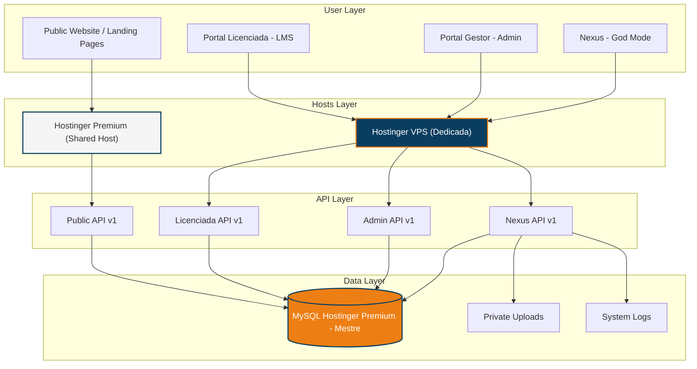
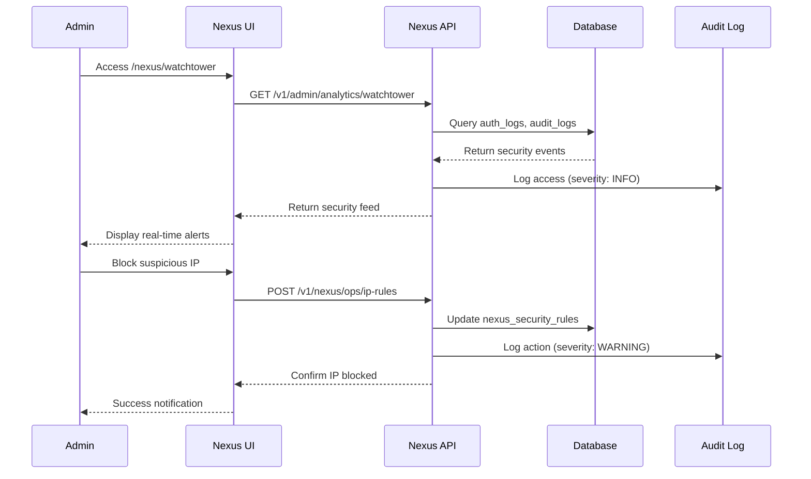

---

# 🏛️ Nexus Architecture Documentation - God Mode System

**Version:** 1.7 (Ubuntu Staging + Dual-Token System)
**Last Updated:** 2026-05-29  
**Status:** Active  
**Access Level:** Superadmin Only

---

## 📋 Overview

**Nexus** is the "God Mode" administrative interface for Body Harmony - a militarized, high-security command center that provides superadmin-level control over every aspect of the system. It sits above the standard Portal Gestor (Admin Panel) and provides deep system access, monitoring, and control capabilities.

### Key Characteristics

- **Military-Themed UI:** Watchtower, War Room, Barracks, Engine Room, etc.
- **Real-Time Monitoring:** Live security feeds, analytics, and system health
- **Granular Control:** Database governance, script execution, security rules
- **Audit Trail:** Comprehensive logging of all administrative actions
- **AI Integration:** Doctor Harmony configuration and case review

---

## 🏗️ Architecture Layers

---

## 🔐 Security Model

### Access Control

**Authentication Flow:**
1. Admin login via `/admin` → Standard admin session
2. Nexus access requires **secondary authentication** via `/nexus` gatekeeper
3. Session validated against `admin_users.role = 'superadmin'`
4. All Nexus actions logged to `audit_logs` with severity tracking

**IP Whitelisting:**
- Nexus enforces IP-based access control via `nexus_security_rules`
- `WHITELIST_IPS` (JSON array) - Allowed IPs bypass lockout
- `BLACKLIST_IPS` (JSON array) - Banned IPs permanently blocked

**Rate Limiting:**
- `MAX_LOGIN_ATTEMPTS`: 3 (configurable)
- `LOCKOUT_DURATION_MINUTES`: 15 (configurable)
- Tracked via `auth_logs` table

---

## 🎯 Nexus Modules

### 1. Nexus Home (`/nexus/home`)
**Purpose:** Central dashboard and system overview

**Features:**
- System health summary
- Active alerts count
- Quick access to all modules
- Recent admin activity feed

**API Endpoints:**
- `GET /v1/admin/nexus/system-status`

---

### 2. Watchtower (`/nexus/watchtower`)
**Purpose:** Real-time security monitoring and behavioral threat detection (WATCHTOWER 2.0).

**Features:**
- **Risk Scoring Engine (V45):** Multi-factor analysis calculating 0-100 risk score per login.
- **Behavioral Intelligence:** Tracks device fingerprints, location velocity, and IP reputation.
- **Live Authentication Feed (V48.1):** Real-time stream with color-coded risk markers. Fixed agent identification (Admins/Licenciadas) removing "Ghost" status.
- **Incident Response:** Automated blocking of high-risk (Score > 70) attempts and visual indicators for locked accounts.
- **Session Analysis:** Correlation between hardware fingerprints and user accounts.

**API Endpoints:**
- `GET /v1/admin/analytics/watchtower`
- `GET /v1/admin/nexus/security-metrics` (Includes Risk Data)

**Data Sources:**
- `auth_logs` - Now includes `risk_score` and `risk_details` (JSON).
- `audit_logs` - System-wide event tracking.
- `licenciada_devices` - Hardware fingerprints and geoloc tracking.

---

### 3. War Room (`/nexus/war-room`)
**Purpose:** Business Intelligence and engagement analytics

**Features:**
- Licenciada engagement metrics
- LMS completion rates
- Module popularity analysis
- Revenue tracking (renewal dates)
- Cohort analysis

**API Endpoints:**
- `GET /v1/admin/analytics/war-room`
- `GET /v1/admin/nexus/security-metrics`

**Data Sources:**
- `lms_progress` - Lesson completion
- `lms_quiz_attempts` - Quiz performance
- `licenciadas` - Renewal dates, activity
- `lms_access_logs` - Access patterns

---

### 4. Barracks (`/nexus/barracks`)
**Purpose:** User and access management
 
**Features:**
- **Nexus Device Guard 3.0 (V61):** Controle estrito de sessões simultâneas via **Hardware-Link**.
- **Hardware-Link Linkage:** Identificação de sessão vinculada ao **Fingerprint (X-DEVICE-ID)**, tornando o sistema imune a mudanças de IP (Wi-Fi/4G).
- **Strict FIFO Kicker:** Algoritmo de expulsão automática (First In, First Out). Ao atingir o limite (padrão 2), a sessão mais antiga é revogada instantaneamente.
- **Atomic Middleware Enforcement:** Validação em tempo real no `AuthMiddleware.php`. Tokens de dispositivos com `is_active = 0` são rejeitados imediatamente (HTTP 401).
- **Dual-Token Segregation (V3.1):** Strict isolation between Student and Professional portals. 
    - `X-ALUNA-TOKEN`: For `alunas` table (Course Portal).
    - `X-DEVICE-TOKEN`: For `licenciadas` table (LMS/Professional).
- **User Lifecycle Reset (V48.1):** Self-healing modal to clear failed login attempts (throttling), reset passwords, and manage device limits manually.
- **Device limit Management:** Dynamic UI to set and visualize device limits (1-10) per student to solve connectivity issues in shared networks.
- **Visual Status Tracking:** Real-time indicator of account lockouts (`BLOCK` badges) and failed login counts. Exibição de CPF (desmascarado) e ID para suporte direto.
- **User impersonation (for debugging)**
- **Access diagnostics**
 
**API Endpoints:**
- `GET /v1/admin/users`
- `POST /v1/admin/users`
- `POST /v1/admin/users/check-access`
- `POST /v1/admin/impersonate`
- `GET /v1/admin/admins`
- `POST /v1/admin/admins`
- `GET /v1/admin/sessions`
- `POST /v1/admin/sessions/terminate`

**Data Sources:**
- `admin_users` - Admin accounts
- `licenciadas` - Licenciada accounts
- `admin_sessions` - Active sessions

---

### 5. Engine Room (`/nexus/engine`)
**Purpose:** System health and infrastructure monitoring

**Features:**
- Server resource usage (CPU, memory, disk)
- Database connection pool status
- Error log viewer
- Performance metrics
- Cache statistics

**API Endpoints:**
- `GET /v1/admin/health`
- `GET /v1/admin/logs`

**Monitoring:**
- PHP error logs
- MySQL slow query log
- Apache access/error logs
- Application-level logs

---

### 6. Signal Tower (`/nexus/signal-tower`)
**Purpose:** System-wide broadcast and notification management (Nexus Era V64)

**Features:**
- **Signal Console 2.0:** Interface tática com presets inteligentes (Manutenção, Dicas, Lançamentos).
- **History Persistence:** Drawer lateral no Portal Licenciada exibindo log completo de sinais lidos/não lidos.
- **Audience Segmentation:** Disparos granulares para Admin, Licenciada ou Mentora.
- **Urgent Mode:** Suporte a `is_blocking`, forçando reconhecimento via modal URGENTE.
- **Read Tracking:** Registro atômico de leitura em `system_broadcast_logs`.

**API Endpoints:**
- `GET /v1/broadcasts/active` - Sinais para banners/modais.
- `GET /v1/broadcasts/history` - Histórico completo para o Drawer.
- `POST /v1/broadcasts` - Nova transmissão via Console.
- `POST /v1/broadcasts/acknowledge` - Registro de leitura.

**Data Sources:**
- `system_broadcasts` - Mensagens e tipos.
- `system_broadcast_logs` - Rastreabilidade de leitura por usuário.

---

### 7. Testing Hub (`/nexus/testing-hub`)
**Purpose:** Automated testing and system validation

**Features:**
- Test suite execution
- API endpoint testing
- Database integrity checks
- Frontend smoke tests
- Test result history

**API Endpoints:**
- `GET /v1/admin/nexus/tests/suites`
- `POST /v1/admin/nexus/tests/run`
- `GET /v1/admin/nexus/tests/status`

**Test Categories:**
- **API Tests:** Endpoint availability, response validation
- **Database Tests:** Schema integrity, constraint validation
- **Security Tests:** Authentication, authorization, XSS/SQL injection
- **Performance Tests:** Load testing, response time benchmarks

---

### 8. Review Hub (`/nexus/review-hub`)
**Purpose:** Doctor Harmony AI case review and quality control

**Features:**
- Pending clinical case queue
- AI confidence score review
- Mentor feedback submission
- Case approval/rejection
- Quality metrics

**API Endpoints:**
- `GET /v1/admin/doctor-harmony/cases/pending`
- `POST /v1/admin/doctor-harmony/cases/{id}/review`

**Data Sources:**
- `ai_clinical_cases` - Student submissions
- `ai_mentorship_logs` - AI usage tracking

**Workflow:**
1. Licenciada submits clinical case via Portal Licenciada
2. Doctor Harmony (Gemini AI) analyzes case
3. If `confidence_score < 0.7` → `needs_review = 1`
4. Case appears in Review Hub
5. Mentor reviews and provides feedback
6. Case status updated to `REVIEWED` or `REJECTED`

---

### 9. The Vault (`/nexus/vault`)
**Purpose:** Configuration management and knowledge base

**Features:**
- FAQ management
- System configuration editor
- Sensitive data repository
- Documentation access
- Asset management

**API Endpoints:**
- `GET /v1/faq`
- `POST /v1/faq`
- `PUT /v1/faq/{id}`
- `DELETE /v1/faq/{id}`

**Data Sources:**
- `faq` - Frequently asked questions
- `site_config` - Global configuration
- `ai_config` - Doctor Harmony settings

---

### 10. Database Room (`/nexus/database`)
**Purpose:** Database governance and migration management with Real-Time Oversight (V60).

**Features:**
- **Network Awareness:** Real-time health-check and status of the unifed MySQL 8.4 VPS dedicated container.
- **Real-Time Metrics:** Live stats for Total Tables, Global Row Count, and Disk Usage (MB).
- **Snapshot Engine 2.0:** One-click SQL backup generation with list of historical snapshots.
- **Async Download:** Secure download of generated backups via authenticated API stream.
- **Schema viewer & Migration execution.**
- **Seed data management & Rebuild tools.**

**API Endpoints:**
- `GET /v1/admin/nexus/db/status` (Enhanced with DB Metadata)
- `POST /v1/admin/nexus/db/rebuild`
- `GET /v1/admin/nexus/db/migrations`
- `POST /v1/admin/nexus/db/migrations/run`
- `GET /v1/admin/nexus/db/seeds`
- `POST /v1/admin/nexus/db/seeds/run`
- `GET /v1/admin/nexus/db/scripts`
- `POST /v1/admin/nexus/db/export` (Snapshot Engine)
- `GET /v1/admin/nexus/db/exports` (Historical List)
- `GET /v1/admin/nexus/db/download` (Secure Stream)

**Data Sources:**
- `infrastructure/database/migrations/` - Migration files
- `infrastructure/database/seeds/` - Seed data
- `FULL_DATABASE_RESET_v*.sql` - Master schema

**Safety Features:**
- Confirmation dialogs for destructive operations
- Automatic backups before migrations
- Rollback capability
- Audit logging of all DB operations

---

### 11. Ops (`/nexus/ops`)
**Purpose:** Security operations and rule management

**Features:**
- IP whitelist/blacklist management
- Security rule configuration
- Audit log viewer
- Incident response tools
- Compliance reporting

**API Endpoints:**
- `GET /v1/nexus/ops/rules`
- `POST /v1/nexus/ops/rules`
- `GET /v1/nexus/ops/audit`
- `POST /v1/nexus/ops/ip-rules`

**Data Sources:**
- `nexus_security_rules` (SQLite `nexus_ops.db`) - Security configuration & Whitelists
- `nexus_audit_ops` (SQLite `nexus_ops.db`) - Rapid insert system audit trail
- `auth_logs` (MySQL Oracle) - Authentication and Fingerprint tracing

*Note on Architecture:* To prevent MySQL connection exhaustion and extreme latency due to network hops (Ping 300ms overhead), the `NexusOpsController` prioritizes using a local SQLite database (`nexus_ops.db`) for firewall rules and high-volume Ops auditing. Data is synced to MySQL asynchronously or on-demand.*

---

### 12. AI Control Tower (`/nexus/ai-control`)
**Purpose:** Doctor Harmony AI configuration and monitoring

**Features:**
- AI model configuration
- System prompt editor
- Credit/token management
- Usage analytics
- Sandbox testing environment
- Health monitoring

**API Endpoints:**
- `GET /v1/admin/doctor-harmony/config`
- `POST /v1/admin/doctor-harmony/config`
- `GET /v1/admin/doctor-harmony/audit`
- `GET /v1/admin/doctor-harmony/health`
- `POST /v1/admin/doctor-harmony/sandbox`

**Data Sources:**
- `ai_config` - AI configuration
- `ai_mentorship_logs` - Usage logs
- `ai_clinical_cases` - Case history

**Configuration Keys:**
- `ai_name`: "Doctor Harmony"
- `ai_slogan`: "Sua mentora técnica em fisiologia estética"
- `gemini_model`: "gemini-2.0-flash"
- `system_prompt`: AI behavior instructions
- `max_tokens`: Token limit per request
- `temperature`: AI creativity (0-1)
- `credits_per_student`: Monthly credit allocation

---

### 13. Scripts Manager (`/nexus/scripts`)
**Purpose:** Administrative script execution and automation

**Features:**
- Script library
- One-click execution
- Parameter input
- Real-time output streaming
- Execution history
- Error handling

**API Endpoints:**
- `GET /v1/nexus/scripts/list`
- `POST /v1/nexus/scripts/execute`
- `GET /v1/nexus/scripts/history`

**Data Sources:**
- `script_executions` - Execution audit trail
- `@Operations/` - Script repository

**Available Scripts:**
- `sync-media-files`: Sync filesystem with `media_files` table
- `cleanup-orphaned-uploads`: Remove unused files
- `regenerate-thumbnails`: Batch thumbnail generation
- `export-licenciada-data`: LGPD compliance export
- `reset-licenciada-password`: Bulk password reset
- `migrate-legacy-data`: Data migration utilities

**Safety Features:**
- Dry-run mode
- Confirmation prompts
- Automatic logging
- Error recovery
- Rollback capability (where applicable)

---

### 14. Nexus Forensics (`/nexus/forensics`)
**Purpose:** Advanced document analysis and leak tracing
**Version:** V35.0 (Active)

**Features:**
- PDF Analysis & Metadata Extraction
- Hidden Fingerprint Detection
- User Correlation (Who leaked this?)
- Geolocation Tracing
- Database Hash Matching

**API Endpoints:**
- `POST /v1/admin/nexus/forensics/analyze`

**Data Sources:**
- `ai_mentorship_logs` - Forensic audit trail
- `uploads/` - Analyzed files (temporary)

**Cryptographic Standards:**
- **Fingerprint:** AES-256-CBC Encrypted Metadata
- **Integrity:** HMAC-SHA256 Signature
- **Watermark:** Visual Overlay (Name + CPF)

---

## 🔄 Data Flow

### Typical Nexus Workflow

---

## 🎨 Visual Identity

### Color Scheme (Military Theme)

- **Primary:** Navy Blue (#0A3E60) - Authority, trust
- **Accent:** Gold (#ED7E13) - Alerts, CTAs
- **Success:** Green (#28A745) - Healthy status
- **Warning:** Yellow (#FFC107) - Caution
- **Danger:** Red (#DC3545) - Critical alerts
- **Background:** Dark (#051A29) - Military aesthetic

### Typography

- **Headings:** Montserrat Bold (All Caps for impact)
- **Body:** Montserrat Regular
- **Monospace:** Courier New (for logs, code)

### UI Patterns

- **Cards:** Dark backgrounds with gold borders
- **Tables:** Striped rows, sortable columns
- **Alerts:** Color-coded severity levels
- **Buttons:** Military-style with hover effects
- **Icons:** FontAwesome military/tech icons

---

## 🔧 Technical Implementation

### Frontend Stack

- **Framework:** React 18
- **Router:** React Router v6
- **State:** React Context API
- **Charts:** Recharts (for analytics)
- **Icons:** FontAwesome
- **Styling:** CSS Modules + Global Styles

### Backend Stack

- **Language:** PHP 8.4 (V3.1 Standard)
- **Database:** MySQL 8.0+ (Hostinger Primary) / MySQL 8.4.8 (Ubuntu Staging LAN)
- **Authentication:** Token-based (admin_sessions)
- **API:** RESTful JSON API v1 (Licenciada focus)

### Security Measures

1. **Authentication:**
   - Dual-layer: Admin login + Nexus gatekeeper
   - Token expiration (24 hours)
   - Session invalidation on logout

2. **Authorization:**
   - Role-based access control (RBAC)
   - Superadmin-only routes
   - IP whitelisting

3. **Audit:**
   - All actions logged to `audit_logs`
   - Severity levels: INFO, WARNING, ERROR, CRITICAL
   - IP address tracking
   - User agent logging

4. **Input Validation:**
   - Server-side validation
   - SQL injection prevention (PDO prepared statements)
   - XSS prevention (output escaping)

---

## 📊 Performance Considerations

### Caching Strategy

- **Static Assets:** Browser cache (1 year) via `.htaccess` (hashed assets only)
- **API Responses (Nexus ResponseCache V2):** 
  - **File-based Cache:** Armazenado em `/tmp` no servidor.
  - **Global Public Cache (V54):** Endpoints estáticos (`site_config`, `licenciadas`, `mentors`, etc) utilizam cache não segmentado por usuário, maximizando o reaproveitamento e reduzindo o consumo de conexões simultâneas.
  - **Stale-While-Revalidate:** Em caso de falha no DB (PDOException capturada pelo `LazyDb`), o sistema serve a última resposta saudável em vez de dar erro 503.
  - **Auto-Invalidation:** Chaves públicas são invalidadas automaticamente em rotas de escrita (POST/PUT/DELETE).
- **Database Queries:** Connection pooling & **Lazy Database Connection (V44)** & **Resilience Engine (V54)**
- **Infrastructure:** Enforced `localhost` database peering on Hostinger for maximum connection quota

### Optimization

- **Lazy Loading:** Nexus modules loaded on-demand
- **Pagination:** Large datasets paginated (50 items/page)
- **Session Optimization (V49.1):** 30-second debounced persistence for mentorship state
- **Compression:** Gzip enabled for API responses

---

## 🚀 Future Enhancements

### Planned Features

1. **Real-Time WebSockets:**
   - Live security feed updates
   - Real-time system health monitoring
   - Instant alert notifications

2. **Advanced Analytics:**
   - Predictive analytics (Licenciada churn prediction)
   - Anomaly detection (unusual access patterns)
   - Revenue forecasting

3. **Automation:**
   - Scheduled script execution (cron-like)
   - Auto-scaling rules
   - Self-healing mechanisms
   - Licenciada churn prediction AI

4. **Multi-Tenancy:**
   - Support for multiple Body Harmony instances
   - Centralized Nexus for all tenants
   - Cross-tenant analytics

---

## 📚 Related Documentation

- [Architecture V6](./01-architecture-v6.md) - Overall system architecture
- [Database Schema](./12-database-schema.md) - Database structure
- [Routes Glossary](./spec_pages_routes_glossary.md) - All routes and endpoints
- [Visual Identity V3](./visual-identity-v3.md) - Brand guidelines
- [Operations Manual](./20-operations-manual.md) - Deployment and maintenance

---

## 🔐 Access Credentials

**Production Access:**
- URL: `https://bodyharmony.com.br/nexus`
- Requires: Superadmin role + IP whitelist

**Development Access:**
- URL: `http://localhost:5173/nexus`
- Default superadmin: `bodyharmony` (see `.env` for password)

---

**Last Updated:** 2026-05-29  
**Generated By:** Antigravity (OpenSpec V3.1)  
**Maintained By:** Superadmin Team
