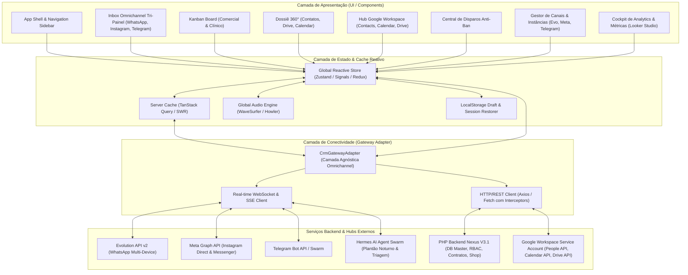

# 🏛️ System Design — Frontend CRM Body Harmony V4
**Versão:** 4.0.0-PROD  
**Contexto:** `https://crm.bodyharmony.com.br/`  
**Padrão Estético:** Body Harmony Luxury Standard (Navy `#0A3E60`, Luxury Gold `#ED7E13`, Ice White `#FFFFFF`, Background Slate `#F8FAFC`)

---

## 1. Visão Geral e Princípios Arquiteturais

O Frontend do CRM Body Harmony V4 é concebido como uma **Single Page Application (SPA) Standalone** de alta performance, ultra-responsiva e ergonomicamente densa, projetada para atender simultaneamente operações comerciais de alta conversão (venda de franquias, cursos, ingressos de congressos) e atendimento clínico/pós-venda para a rede de Licenciadas e Alunas.

### 📐 Princípios Norteadores:
1. **Zero Latência Percebida (Optimistic UI):** Qualquer ação do usuário (envio de mensagem, troca de status no funil, aplicação de tag, anotação interna) reflete instantaneamente na interface com fila assíncrona de sincronização em segundo plano e retentativa exponencial.
2. **Workspace-First & Densidade Ergonômica:** Eliminação de desperdício vertical. A área de trabalho do atendente ocupa 100% da viewport útil com rolagem independente por painel e transições sem recarregamento de página.
3. **Desacoplamento de Backend (Agnostic Adapter Pattern):** O frontend não se acopla diretamente a uma ferramenta específica (como Chatwoot nativo ou Evolution API bruta). Ele consome uma camada de abstração de API unificada (`CrmGatewayAdapter`) que normaliza eventos de WebSocket, rotas REST e webhooks de IA.
4. **Isolamento de Estado de Áudio (Global Audio Singleton):** A reprodução de mensagens de voz do WhatsApp não é interrompida ao navegar entre conversas ou abas. Há um miniplayer fixo ou persistente com controle de velocidade ($1.0\times, 1.5\times, 2.0\times$) e transcrição de áudio via IA sob demanda.

---

## 2. Diagrama de Arquitetura de Alto Nível (Mermaid)




---

## 3. Modelo de Dados Unificado no Frontend (Entities & DTOs)

### 3.1. Objeto `Conversation` (Conversa)
```typescript
interface Conversation {
  id: string;                    // UUID ou identificador único da conversa
  channel: 'WHATSAPP' | 'INSTAGRAM' | 'TELEGRAM' | 'WEBCHAT'; // Canal de entrada
  instanceId: string;            // Identificador da linha ou conta (ex: 'inst_comercial_01', 'ig_bodyharmony', 'tg_bot_01')
  contact: {
    id: string;
    name: string;
    phone?: string;              // E.164 (ex: '+5518996959486')
    socialUsername?: string;     // @perfil do Instagram ou @username do Telegram
    avatarUrl?: string;
    document?: string;           // CPF ou CNPJ formatado
    category: 'LEAD' | 'LICENCIADA' | 'ALUNA' | 'PARCEIRA' | 'DESCONHECIDO';
    city?: string;
    state?: string;
    googleContactsSyncId?: string; // ID sincronizado no Google Contacts
    googleDriveFolderId?: string;  // ID da pasta do paciente no Google Drive
  };

  unreadCount: number;
  status: 'OPEN' | 'PENDING' | 'RESOLVED' | 'SNOOZED';
  priority: 'LOW' | 'MEDIUM' | 'HIGH' | 'URGENT';
  assignedAgent?: {
    id: string;
    name: string;
    avatarUrl?: string;
    isAiBot: boolean;
  };
  lastMessage: {
    id: string;
    text: string;
    senderType: 'CONTACT' | 'AGENT' | 'SYSTEM' | 'AI_BOT';
    timestamp: string;           // ISO 8601
    mediaType?: 'text' | 'audio' | 'image' | 'video' | 'document' | 'location';
    status: 'SENDING' | 'SENT' | 'DELIVERED' | 'READ' | 'FAILED';
  };
  funnelStage: {
    funnelId: string;
    stageId: string;
    stageName: string;
    stageColor: string;
  };
  tags: Array<{ id: string; name: string; color: string }>;
  isPinned: boolean;
  isMuted: boolean;
  updatedAt: string;
}
```

### 3.2. Objeto `Message` (Mensagem com Suporte a Rich Media)
```typescript
interface Message {
  id: string;
  conversationId: string;
  sender: {
    id: string;
    name: string;
    role: 'CLIENT' | 'ATTENDANT' | 'HERMES_AI' | 'SYSTEM';
  };
  content: string;               // Texto ou legenda
  type: 'TEXT' | 'AUDIO' | 'IMAGE' | 'VIDEO' | 'DOCUMENT' | 'LOCATION' | 'WHISPER_NOTE' | 'EVENT_LOG';
  media?: {
    url: string;
    mimeType: string;
    fileName?: string;
    fileSizeBytes?: number;
    durationSeconds?: number;    // Para áudios e vídeos
    waveform?: number[];         // Amostras da forma de onda para renderização visual
    transcription?: string;      // Transcrição de áudio por IA
  };
  deliveryStatus: 'QUEUED' | 'SENT' | 'DELIVERED' | 'READ' | 'ERROR';
  replyToMessage?: {
    id: string;
    senderName: string;
    snippet: string;
  };
  reactions?: Array<{ emoji: string; count: number; users: string[] }>;
  createdAt: string;
  isInternalNote: boolean;       // Whisper Note (visível apenas para a equipe interna)
}
```

---

## 4. Gestão de Tempo Real (WebSockets & Event Flow)

A camada de tempo real opera sob conexão persistente bidirecional com reconexão exponencial ($1\text{s}, 2\text{s}, 4\text{s}, 8\text{s}, \text{max } 30\text{s}$) e batimento cardíaco (ping a cada 25s):

1. **`message.received`**: Atualiza a lista de conversas, incrementa `unreadCount`, adiciona a mensagem ao canvas aberto (se for a conversa atual) e emite som suave de notificação se a aba estiver em segundo plano.
2. **`message.status_update`**: Atualiza os tiques de envio (cinza único $\to$ cinza duplo $\to$ azul duplo).
3. **`typing.indicator`**: Exibe *"Fulano está digitando..."* com debounce de 3 segundos.
4. **`presence.update`**: Atualiza badges de online/offline das linhas WhatsApp e dos atendentes.
5. **`ai.handoff_requested`**: Notificação sonora e visual de alta prioridade quando a IA Hermes solicita transbordo para operador humano.

---

## 5. Design System & Tokens Oficiais Luxury com Alto Contraste (WCAG AAA)

> [!IMPORTANT]
> **Regra de Legibilidade e Contraste Estrito (Zero Texto Mudo em Fundos Escuros):**
> É terminantemente proibido utilizar tons de azul escuro ou cinza chumbo escuro para textos sobre superfícies escuras. Todos os textos devem atender rigorosamente ao padrão **WCAG AAA** (contraste mínimo de 7:1 para texto normal e 4.5:1 para texto grande).

### 5.1. Superfícies Escuras (Sidebar `#072B44` e Headers Navy `#0A3E60`)
- **Texto Principal / Títulos:** `#FFFFFF` (Branco puro — 100% legibilidade).
- **Texto Secundário / Menus Inativos:** `#E2E8F0` (Slate 200 — contraste $\ge 10.5:1$).
- **Ícones Inativos:** `#94A3B8` (Slate 400) com transição para `#FFFFFF` no hover.
- **Item Ativo do Menu:** Background `rgba(237, 126, 19, 0.20)` (Pill dourada translúcida) + Borda esquerda `3px solid #ED7E13` + Texto em Ouro Vibrante `#FFB366` ou Branco `#FFFFFF` com `font-weight: 700`.
- **Botão CTA Principal ("+ Novo Paciente / Lead"):** Background `#ED7E13` (Luxury Gold) + Texto `#FFFFFF` (Branco Puro em Negrito) + Sombra `0 4px 14px rgba(237, 126, 19, 0.40)`.

### 5.2. Superfícies Claras (Área de Trabalho `#F8FAFC`, Cards `#FFFFFF` e Chat)
- **Texto Principal (Títulos, Nomes, Mensagens do Cliente):** `#0F172A` (Slate 900 / Deep Navy).
- **Texto Secundário (Horários, Subtítulos, Metadados):** `#475569` (Slate 600 — contraste $\ge 7:1$).
- **Bordas e Divisores:** `#CBD5E1` / `#E2E8F0` (Linhas nítidas, sem aspecto embaçado).
- **Balões de Mensagem:**
  - *Recebidas (Cliente):* Fundo `#FFFFFF` com borda `1px solid #CBD5E1` e texto `#0F172A`.
  - *Enviadas (Atendente):* Fundo `#0A3E60` (Navy) com texto `#FFFFFF` e hora/tiques em `#93C5FD`.
  - *Notas Internas (Whisper):* Fundo `#FEF3C7` (Âmbar 100) com borda `1px dashed #D97706` e texto `#78350F`.

### 5.3. Paleta de Ações e Status
- **Primary Brand:** `#0A3E60`
- **Accent Brand (CTAs & Badges):** `#ED7E13` (Hover: `#D46D0E`, Active: `#BA5F0C`)
- **Success (Online / Conectado / Venda Ganha):** `#10B981` (Badge: Fundo `#D1FAE5`, Texto `#065F46`)
- **Warning (Pendente / Atenção / IA Transbordo):** `#F59E0B` (Badge: Fundo `#FEF3C7`, Texto `#92400E`)
- **Danger (Desconectado / Erro / Perdido):** `#EF4444` (Badge: Fundo `#FEE2E2`, Texto `#991B1B`)
- **Tipografia:** `Outfit` (Headings, KPIs, Botões de Destaque) e `Montserrat` / `Inter` (Corpo e Chat).

