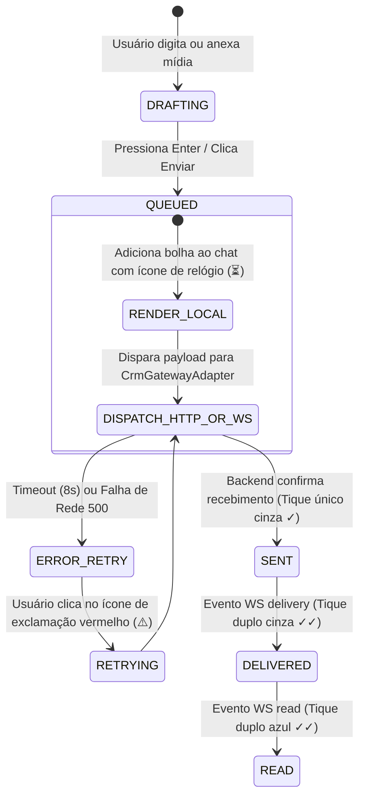

# ⚙️ Comportamentos de Tela & Máquinas de Estado — CRM Body Harmony V4
**Contexto:** Especificação Dinâmica de UX, Interações e State Machines

---

## 1. Módulo 1: Inbox Workspace Tri-Painel (`/inbox/*`)

### 1.1. Layout Físico dos 3 Painéis
- **Coluna 1 (Lista de Conversas Omnichannel — 320px a 380px):**
  - Barra de busca universal (`Ctrl+F` ou `Ctrl+K`) com busca por nome, telefone ou @usuario.
  - Seletor rápido de Canais: `[Todos (32)]` `[🟢 WhatsApp (24)]` `[📸 Instagram Direct (5)]` `[✈️ Telegram (3)]`.
  - Filtro por status: *Todas*, *Não Lidas*, *Atribuídas a Mim*, *Plantão IA*, *Por Tag*.
  - Itens de conversa com avatar, badge do canal social (ícone colorido do WhatsApp, Instagram ou Telegram), status de presença, snippet da última mensagem e contador de não lidas em dourado (`#ED7E13`).

- **Coluna 2 (Canvas Central de Chat — Flex 1):**
  - **Header do Chat:** Nome do contato / @perfil, status de digitação, badge do canal (ex: `Instagram Direct: @dra.camila`), atendente responsável, botão de chamada WhatsApp / Google Meet e botão de alternar Dossiê lateral (`Alt+D`).
  - **Área de Mensagens (Virtual Scroll):** Bolhas de mensagens com indicador visual sutil do canal de origem (WhatsApp / Instagram / Telegram). Suporte a envio de texto, áudio com waveform, fotos, vídeos, PDFs e Whisper Notes internas.
  - **Barra de Digitação:** Campo auto-expansível, anexos, microfone, respostas rápidas (`/`), alternador para nota interna e botão de envio em Gold (`#ED7E13`).

- **Coluna 3 (Dossiê 360° Retrátil com Hub Google Workspace — 360px a 420px):**
  - **Aba 1 (Perfil & Redes Sociais):** Foto, Nome completo, CPF/CNPJ, Telefone WhatsApp, @Instagram, @Telegram, Cidade/UF, Categoria (*Lead*, *Licenciada*, *Aluna*).
  - **Aba 2 (Google Workspace Suite):**
    * `[📅 Agendar no Google Calendar]`: Abre modal para marcar consulta/mentoria com link automático do Google Meet e envio de confirmação no WhatsApp/Email.
    * `[📁 Abrir Pasta no Google Drive]`: Link direto para a pasta sincronizada da paciente `[BH] {Nome_CPF}` contendo fotos antes/depois, fichas de anamnese e PDFs de contratos.
    * `[📇 Sincronizar Google Contacts]`: Sincroniza em 1 clique com o Google Contacts oficial da Body Harmony.
  - **Aba 3 (Contratos & Assinaturas):** Lista de contratos vinculados, status (`PENDING_SIGNATURE` vs `SIGNED`), link de assinatura e botão de emissão rápida.
  - **Aba 4 (Compras & Loja):** Histórico de pedidos no `/shop` (Ingressos de Congressos, Cursos, Equipamentos).
  - **Aba 5 (Notas & Timeline):** Linha do tempo unificada de interações (WhatsApp + Instagram + Telegram + Logs da IA Hermes).

### 1.2. Máquina de Estados do Envio de Mensagem (Optimistic UI)

---

## 2. Módulo 2: Funis & Kanban (`/kanban/*`)

### 2.1. Comportamento e Interatividade
1. **Seletor de Funil:** Alternância instantânea entre **Funil Comercial (Leads/Franquias)** e **Funil Clínico (Pós-Venda/Licenciadas)**.
2. **Colunas com Indicadores:** Cada coluna exibe contagem de cards e valor total acumulado em R$ daquela etapa.
3. **Card do Lead / Paciente:**
   - Nome, telefone, última interação (tempo relativo: *há 15 min*).
   - Tag de prioridade (*Urgente*, *Quente*, *Frio*).
   - Avatar do atendente responsável.
   - Botão de 1-clique para abrir o chat diretamente na conversa com o lead.
4. **Arrastar e Soltar (Drag & Drop):**
   - Transição fluida com sombra projetada.
   - Ao soltar o card em nova etapa, executa atualização otimista na tela e dispara webhook de transição (que pode acionar mensagens automáticas ou reclassificação no banco de dados).

---

## 3. Módulo 3: Central de Instâncias WhatsApp (`/instances`)

### 3.1. Cards de Monitoramento de Linhas
Cada card representa uma conexão física com chip WhatsApp:
- **Header:** Nome da linha (*ex: Linha Principal - Assis*, *Linha Suporte Pós-Venda*), número E.164.
- **Status Badge:**
  - 🟢 `CONECTADO` (Exibe nível de bateria do celular, sinal e versão do WhatsApp).
  - 🟡 `RECONECTANDO / GERANDO QR`
  - 🔴 `DESCONECTADO`
- **Ações:**
  - Botão *"Parear QR Code"*: Abre modal com leitor de QR Code auto-atualizável a cada 20 segundos até a confirmação do handshake.
  - Botão *"Reiniciar Sessão"*: Reinicia a instância na Evolution API sem perder histórico.
  - Botão *"Desconectar / Logout"*.

---

## 4. Módulo 4: Disparador em Massa Anti-Ban (`/campaigns`)

### 4.1. Fluxo de Criação de Campanha
1. **Etapa 1 — Segmentação:** Seleção de lista por tags (*ex: Alunas Congresso 2026*, *Leads Franquia SP*).
2. **Etapa 2 — Composição da Mensagem:** Editor com suporte a variáveis dinâmicas (`{{nome}}`, `{{cidade}}`, `{{protocolo}}`) e preview interativo simulando WhatsApp real em tempo real.
3. **Etapa 3 — Políticas Anti-Ban & Warm-Up:**
   - Intervalo randômico entre mensagens (ex: de 18 a 42 segundos).
   - Rotação dinâmica de linhas WhatsApp (distribui 50 disparos por linha conectada).
   - Pausa programada após cada bloco de 30 envios.
4. **Etapa 4 — Monitoramento em Tempo Real:** Barra de progresso com contador de *Enviadas*, *Entregues*, *Lidas* e *Falhas*.
